## tobybreckon > backgroundModel.kt
<a href="./src/main/kotlin/tobybreckon/backgroundModel.kt">backgroundModel.kt</a>
```java
fun main(args: Array<String>) {
    Origami.init()
    val foreground = Mat()
    val fg_mask = Mat()
    val MoG = Video.createBackgroundSubtractorMOG2()
    Camera().device(0).filter(Filter()
        {
            MoG.apply(it, fg_mask, 0.1)
            cvtColor(fg_mask, fg_mask, COLOR_GRAY2BGR)
            bitwise_and(it, fg_mask, foreground)
            foreground
        }
    ).run()
}
```
## tobybreckon > hogPeopleDetection.kt
<a href="./src/main/kotlin/tobybreckon/hogPeopleDetection.kt">hogPeopleDetection.kt</a>
```java
fun main(args: Array<String>) {
    Origami.init()
    val HOG = HOGDescriptor()
    HOG.setSVMDetector(HOGDescriptor.getDefaultPeopleDetector())
    val foundLocations = MatOfRect()
    val foundWeights = MatOfDouble()
    val color = Scalar(255.0, 0.0, 0.0)
    Camera().device(0).filter(Filter() {
        HOG.detectMultiScale(
            it, foundLocations, foundWeights, 0.0, Size(8.0, 8.0), Size(32.0, 32.0),
            1.05, 8.0, false
        )
        drawLocations(foundLocations, it, color)
    }).run()
}
private fun drawLocations(foundLocations: MatOfRect, it: Mat?, color: Scalar): Mat? {
    val rectangles = foundLocations.toList()
    for (i in rectangles.indices) {
        rectangle(
            it, Point(rectangles[i].x.toDouble(), rectangles[i].y.toDouble()),
            Point(
                (rectangles[i].x + rectangles[i].width).toDouble(),
                (rectangles[i].y + rectangles[i].height).toDouble()
            ),
            color, 2, 1, 0
        )
    }
    return it
}
```
## dip > ApplyingBoxFilter.kt
<a href="./src/main/kotlin/dip/ApplyingBoxFilter.kt">ApplyingBoxFilter.kt</a>
```java
fun createKernelOfSize(kernelSize: Int): Mat {
    val kernel = Mat.ones(kernelSize, kernelSize, CvType.CV_32F)
    for (i in 0 until kernel.rows()) {
        for (j in 0 until kernel.cols()) {
            val m = kernel[i, j]
            for (k in m.indices) {
                m[k] = m[k] / (kernelSize * kernelSize)
            }
            kernel.put(i, j, *m)
        }
    }
    return kernel
}
fun main(args: Array<String>) {
    Origami.init()
    val source = imread("data/dip/grayscale.jpg", IMREAD_GRAYSCALE)
    val destination = Mat(source.rows(), source.cols(), source.type())
    val kernel5 = createKernelOfSize(5)
    filter2D(source, destination, -1, kernel5)
    imwrite("out/boxfilterKernel5.jpg", destination)
    val kernel9 = createKernelOfSize(9)
    filter2D(source, destination, -1, kernel9)
    imwrite("out/boxfilterKernel9.jpg", destination)
}
```
**< dip**


**> boxfilterKernel5.jpg**


**> boxfilterKernel9.jpg**


## dip > GaussianFilter.kt
<a href="./src/main/kotlin/dip/GaussianFilter.kt">GaussianFilter.kt</a>
```java
fun main(args: Array<String>) {
    Origami.init()
    val source = imread("data/dip/digital_image_processing.jpg", IMREAD_COLOR)
    val destination = Mat(source.rows(), source.cols(), source.type())
    GaussianBlur(source, destination, Size(11.0, 11.0), 0.0)
    imwrite("out/gaussianblur1.jpg", destination)
    GaussianBlur(source, destination, Size(45.0, 45.0), 0.0)
    imwrite("out/gaussianblur45.jpg", destination)
}
```
**< dip**


**> gaussianblur1.jpg**


**> gaussianblur45.jpg**


## dip > ApplyingWatermarkWithROI.kt
<a href="./src/main/kotlin/dip/ApplyingWatermarkWithROI.kt">ApplyingWatermarkWithROI.kt</a>
```java
fun main(args: Array<String>) {
    Origami.init()
    val source = imread("data/dip/digital_image_processing.jpg", IMREAD_COLOR)
    val waterMark = imread("data/dip/watermark.jpg", IMREAD_COLOR)
    val ROI = Rect(20, 20, waterMark.cols(), waterMark.rows())
    addWeighted(source.submat(ROI), 0.8, waterMark, 0.2, 1.0, source.submat(ROI))
    imwrite("out/watermarkedROI.jpg", source)
}
```
**< dip**


**< dip**


**> watermarkedROI.jpg**

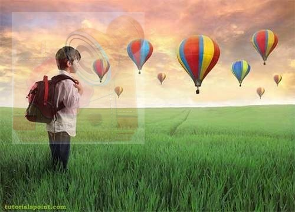

## dip > EnhanceImageSharpness.kt
<a href="./src/main/kotlin/dip/EnhanceImageSharpness.kt">EnhanceImageSharpness.kt</a>
```java
fun main(args: Array<String>) {
    Origami.init()
    val source = imread("data/dip/digital_image_processing.jpg", IMREAD_COLOR)
    val destination = Mat(source.rows(), source.cols(), source.type())
    GaussianBlur(source, destination, Size(1.0, 1.0), 10.0)
    addWeighted(source, 1.5, destination, -0.5, 0.0, destination)
    imwrite("out/sharp.jpg", destination)
}
```
**< dip**


**> sharp.jpg**


## dip > Sobel.kt
<a href="./src/main/kotlin/dip/Sobel.kt">Sobel.kt</a>
```java
fun main(args: Array<String>) {
    init()
    val kernelSize = 3
    val source = imread("data/dip/grayscale.jpg", IMREAD_GRAYSCALE)
    val destination = Mat(source.rows(), source.cols(), source.type())
    val kernel: Mat = object : Mat(kernelSize, kernelSize, CV_32F) {
        init {
            put(0, 0, -1.0)
            put(0, 1, 0.0)
            put(0, 2, 1.0)
            put(1, 0, - 2.0)
            put(1, 1, 0.0)
            put(1, 2, 2.0)
            put(2, 0, -1.0)
            put(2, 1, 0.0)
            put(2, 2, 1.0)
        }
    }
    filter2D(source, destination, -1, kernel)
    imwrite("out/sobel.jpg", destination)
}
```
**< dip**


**> sobel.jpg**

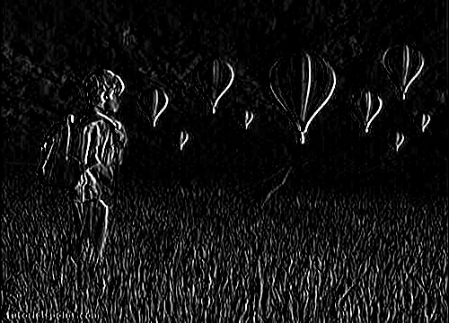

## dip > EnhanceImageBrightness.kt
<a href="./src/main/kotlin/dip/EnhanceImageBrightness.kt">EnhanceImageBrightness.kt</a>
```java
fun main(args: Array<String>) {
    Origami.init()
    var alpha = 2.0
    var beta = 50.0
    val source = imread("data/dip/digital_image_processing.jpg", IMREAD_COLOR)
    val destination = Mat(source.rows(), source.cols(), source.type())
    source.convertTo(destination, -1, alpha, beta)
    imwrite("out/brightWithAlpha2Beta50.jpg", destination)
}
```
**< dip**


**> brightWithAlpha2Beta50.jpg**

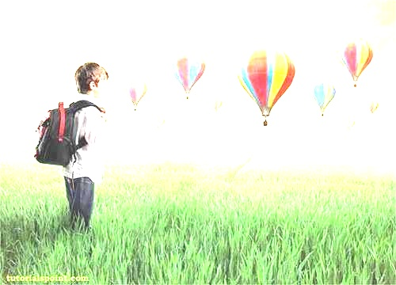

## dip > Prewitt.kt
<a href="./src/main/kotlin/dip/Prewitt.kt">Prewitt.kt</a>
```java
fun main(args: Array<String>) {
    init()
    val kernelSize = 3
    val source = imread("data/dip/grayscale.jpg", IMREAD_GRAYSCALE)
    val destination = Mat(source.rows(), source.cols(), source.type())
    val kernel: Mat = object : Mat(kernelSize, kernelSize, CV_32F) {
        init {
            put(0, 0, -1.0)
            put(0, 1, 0.0)
            put(0, 2, 1.0)
            put(1, 0, -1.0)
            put(1, 1, 0.0)
            put(1, 2, 1.0)
            put(2, 0, -1.0)
            put(2, 1, 0.0)
            put(2, 2, 1.0)
        }
    }
    filter2D(source, destination, -1, kernel)
    imwrite("out/prewitt.jpg", destination)
}
```
**< dip**


**> prewitt.jpg**


## dip > ZoomingEffect.kt
<a href="./src/main/kotlin/dip/ZoomingEffect.kt">ZoomingEffect.kt</a>
```java
fun main(args: Array<String>) {
    Origami.init()
    val source = imread("data/dip/grayscale.jpg", IMREAD_GRAYSCALE)
    val zoomingFactor = 3
    val destination = Mat(source.rows(), source.cols(), source.type())
    resize(
        source,
        destination,
        destination.size(),
        zoomingFactor.toDouble(),
        zoomingFactor.toDouble(),
        INTER_LINEAR
    )
    imwrite("out/zoomed2.jpg", destination)
}
```
**< dip**


**> zoomed2.jpg**

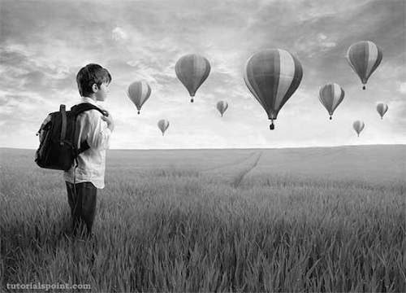

## dip > Kirsch.kt
<a href="./src/main/kotlin/dip/Kirsch.kt">Kirsch.kt</a>
```java
fun main(args: Array<String>) {
    init()
    val kernelSize = 3
    val source = imread("data/dip/grayscale.jpg", IMREAD_GRAYSCALE)
    val destination = Mat(source.rows(), source.cols(), source.type())
    val kernel: Mat = object : Mat(kernelSize, kernelSize, CV_32F) {
        init {
            put(0, 0, -3.0)
            put(0, 1, -3.0)
            put(0, 2, -3.0)
            put(1, 0, -3.0)
            put(1, 1, -3.0)
            put(1, 2, -3.0)
            put(2, 0, 5.0)
            put(2, 1, 5.0)
            put(2, 2, 5.0)
        }
    }
    filter2D(source, destination, -1, kernel)
    imwrite("out/kirsch.jpg", destination)
}
```
**< dip**


**> kirsch.jpg**

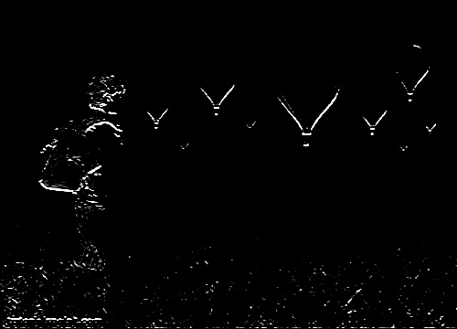

## dip > Pixelize.kt
<a href="./src/main/kotlin/dip/Pixelize.kt">Pixelize.kt</a>
```java
/**
 * https://stackoverflow.com/questions/55508615/how-to-pixelate-image-using-opencv-in-python
 */
fun main(args: Array<String>) {
    init()
    val (source, temp,target) = listOf(imread("data/bear.png"), Mat(),Mat())
     val (w, h) = listOf(16.0, 16.0)
    resize(source, temp, Size(w, h), 1.0,1.0, INTER_LINEAR)
    resize(temp, target, source.size(), 1.0,1.0,INTER_NEAREST)
    imwrite("out/pixelized.jpg", target)
}
```
**< bear.png**

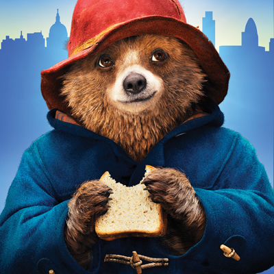

**> pixelized.jpg**

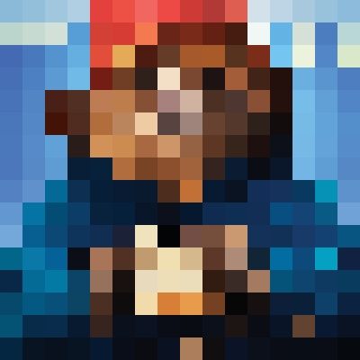

## dip > ImageShapeConversions.kt
<a href="./src/main/kotlin/dip/ImageShapeConversions.kt">ImageShapeConversions.kt</a>
```java
fun main(args: Array<String>) {
    Origami.init()
    val input = File("data/dip/digital_image_processing.jpg")
    val image = ImageIO.read(input)
    val data = (image.raster.dataBuffer as DataBufferByte).data
    val mat = Mat(image.height, image.width, CvType.CV_8UC3)
    mat.put(0, 0, data)
    val mat1 = Mat(image.height, image.width, CvType.CV_8UC3)
    flip(mat, mat1, -1)
    val data1 = ByteArray(mat1.rows() * mat1.cols() * mat1.elemSize().toInt())
    mat1[0, 0, data1]
    val image1 = BufferedImage(mat1.cols(), mat1.rows(), 5)
    image1.raster.setDataElements(0, 0, mat1.cols(), mat1.rows(), data1)
    val outout = File("hsv.jpg")
    ImageIO.write(image1, "jpg", outout)
}
```
## dip > BasicThresholding.kt
<a href="./src/main/kotlin/dip/BasicThresholding.kt">BasicThresholding.kt</a>
```java
fun main(args: Array<String>) {
    Origami.init()
    val source = imread("data/dip/digital_image_processing.jpg", IMREAD_COLOR)
    val destination = Mat(source.rows(), source.cols(), source.type())
    threshold(source, destination, 127.0, 255.0, THRESH_TOZERO)
    imwrite("out/ThreshZero.jpg", destination)
    threshold(source, destination, 127.0, 255.0, THRESH_TOZERO_INV)
    imwrite("out/ThreshZeroInv.jpg", destination)
    threshold(source, destination, 127.0, 255.0, THRESH_BINARY)
    imwrite("out/ThreshBinary.jpg", destination)
    threshold(source, destination, 127.0, 255.0, THRESH_BINARY_INV)
    imwrite("out/ThreshBinaryInv.jpg", destination)
}
```
**< dip**


**> ThreshZero.jpg**

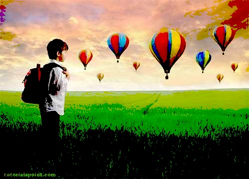

**> ThreshZeroInv.jpg**

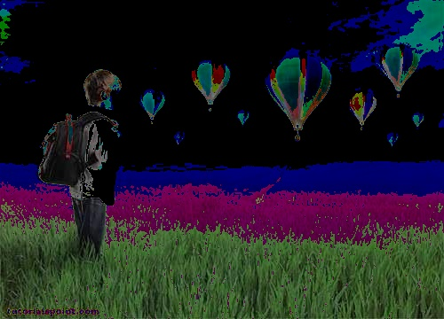

**> ThreshBinary.jpg**

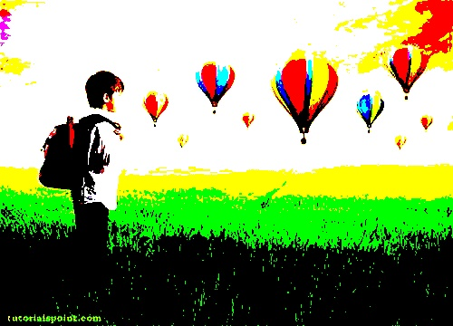

**> ThreshBinaryInv.jpg**

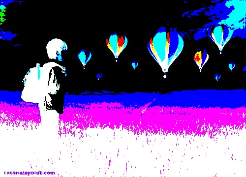

## dip > EnhanceImageContrast.kt
<a href="./src/main/kotlin/dip/EnhanceImageContrast.kt">EnhanceImageContrast.kt</a>
```java
fun main(args: Array<String>) {
    Origami.init()
    val source = imread("data/dip/grayscale.jpg", IMREAD_GRAYSCALE)
    val destination = Mat(source.rows(), source.cols(), source.type())
    equalizeHist(source, destination)
    imwrite("out/contrast.jpg", destination)
}
```
**< dip**


**> contrast.jpg**

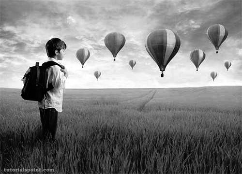

## dip > ImagePyramid.kt
<a href="./src/main/kotlin/dip/ImagePyramid.kt">ImagePyramid.kt</a>
```java
fun main(args: Array<String>) {
    Origami.init()
    var source = imread("data/dip/digital_image_processing.jpg", IMREAD_COLOR)
    val destination1 = Mat(source.rows() * 2, source.cols() * 2, source.type())
    pyrUp(source, destination1, Size((source.cols() * 2).toDouble(), (source.rows() * 2).toDouble()))
    imwrite("out/pyrUp.jpg", destination1)
    source = imread("data/dip/digital_image_processing.jpg", IMREAD_COLOR)
    val destination = Mat(source.rows() / 2, source.cols() / 2, source.type())
    pyrDown(source, destination, Size((source.cols() / 2).toDouble(), (source.rows() / 2).toDouble()))
    imwrite("out/pyrDown.jpg", destination)
}
```
**< dip**


**< dip**


**> pyrUp.jpg**


**> pyrDown.jpg**


## dip > ErodingDilating.kt
<a href="./src/main/kotlin/dip/ErodingDilating.kt">ErodingDilating.kt</a>
```java
fun main(args: Array<String>) {
    Origami.init()
    val source = imread("data/dip/digital_image_processing.jpg", IMREAD_COLOR)
    val destination = Mat(source.rows(), source.cols(), source.type())
    val erosion_size = 5
    val element = getStructuringElement(
        MORPH_RECT,
        Size((2 * erosion_size + 1).toDouble(), (2 * erosion_size + 1).toDouble())
    )
    erode(source, destination, element)
    imwrite("out/erosion.jpg", destination)
    val dilation_size = 5
    val element1 = getStructuringElement(
        MORPH_RECT,
        Size((2 * dilation_size + 1).toDouble(), (2 * dilation_size + 1).toDouble())
    )
    dilate(source, destination, element1)
    imwrite("out/dilation.jpg", destination)
}
```
**< dip**


**> erosion.jpg**


**> dilation.jpg**

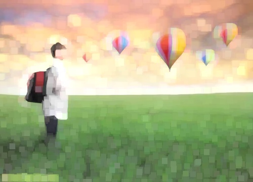

## dip > AddingBorder.kt
<a href="./src/main/kotlin/dip/AddingBorder.kt">AddingBorder.kt</a>
```java
fun main(args: Array<String>) {
    Origami.init()
    val source = imread("data/dip/digital_image_processing.jpg")
    val destination = Mat(source.rows(), source.cols(), source.type())
    val top = source.rows() / 20
    val bottom = source.rows() / 20
    val left = source.cols() / 20
    val right = source.cols() / 20
    copyMakeBorder(source, destination, top, bottom, left, right, BORDER_WRAP)
    imwrite("out/borderWrap.jpg", destination)
    copyMakeBorder(source, destination, top, bottom, left, right, BORDER_REFLECT)
    imwrite("out/borderReflect.jpg", destination)
    copyMakeBorder(source, destination, top, bottom, left, right, BORDER_REPLICATE)
    imwrite("out/borderReplicate.jpg", destination)
}
```
**< dip**


**> borderWrap.jpg**

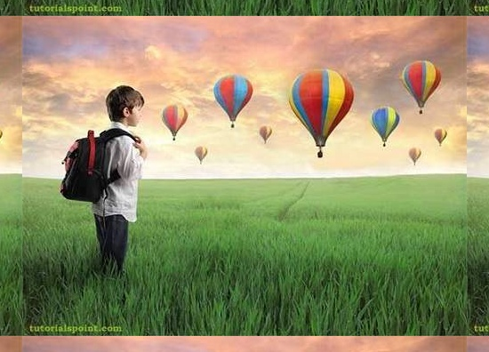

**> borderReflect.jpg**


**> borderReplicate.jpg**


## dip > WeightedAverage.kt
<a href="./src/main/kotlin/dip/WeightedAverage.kt">WeightedAverage.kt</a>
```java
fun main(args: Array<String>) {
    Origami.init()
    val kernelSize = 9
    val source = imread("data/dip/grayscale.jpg", Imgcodecs.IMREAD_GRAYSCALE)
    val destination = Mat(source.rows(), source.cols(), source.type())
    val kernel = Mat.ones(kernelSize, kernelSize, CvType.CV_32F)
    for (i in 0 until kernel.rows()) {
        for (j in 0 until kernel.cols()) {
            val m = kernel[i, j]
            for (k in m.indices) {
                if (i == 1 && j == 1) {
                    m[k] = (10 / 18).toDouble()
                } else {
                    m[k] = m[k] / 18
                }
            }
            kernel.put(i, j, *m)
        }
    }
    filter2D(source, destination, -1, kernel)
    imwrite("out/weightedaveragefilter.jpg", destination)
}
```
**< dip**


**> weightedaveragefilter.jpg**

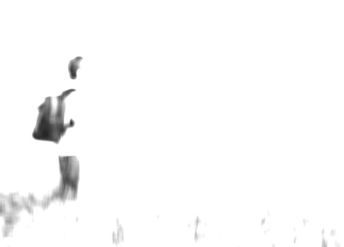

## dip > Convolution.kt
<a href="./src/main/kotlin/dip/Convolution.kt">Convolution.kt</a>
```java
fun main(args: Array<String>) {
    init()
    val kernelSize = 3
    val source = imread("data/dip/grayscale.jpg", IMREAD_GRAYSCALE)
    val destination = Mat(source.rows(), source.cols(), source.type())
    val kernel: Mat = object : Mat(kernelSize, kernelSize, CV_32F) {
        init {
            put(0, 0, 0.0)
            put(0, 1, 0.0)
            put(0, 2, 0.0)
            put(1, 0, 0.0)
            put(1, 1, 1.0)
            put(1, 2, 0.0)
            put(2, 0, 0.0)
            put(2, 1, 0.0)
            put(2, 2, 0.0)
        }
    }
    filter2D(source, destination, -1, kernel)
    imwrite("out/understand.jpg", destination)
}
```
**< dip**


**> understand.jpg**


## dip > Laplacian.kt
<a href="./src/main/kotlin/dip/Laplacian.kt">Laplacian.kt</a>
```java
fun main(args: Array<String>) {
    init()
    val kernelSize = 3
    val source = imread("data/dip/grayscale.jpg", IMREAD_GRAYSCALE)
    val destination = Mat(source.rows(), source.cols(), source.type())
    val kernel: Mat = object : Mat(kernelSize, kernelSize, CV_32F) {
        init {
            put(0, 0, 0.0)
            put(0, 1, -1.0)
            put(0, 2, 0.0)
            put(1, 0, - 1.0)
            put(1, 1, 4.0)
            put(1, 2, -1.0)
            put(2, 0, 0.0)
            put(2, 1, -1.0)
            put(2, 2, 0.0)
        }
    }
    filter2D(source, destination, -1, kernel)
    imwrite("out/laplacian.jpg", destination)
}
```
**< dip**


**> laplacian.jpg**

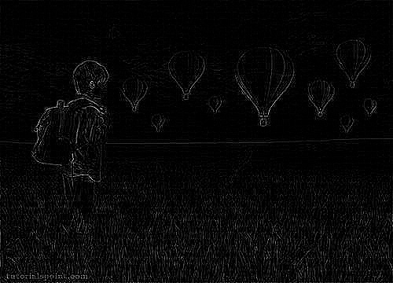

## dip > ColorSpaceConversion.kt
<a href="./src/main/kotlin/dip/ColorSpaceConversion.kt">ColorSpaceConversion.kt</a>
```java
fun main(args: Array<String>) {
    Origami.init()
    val mat = imread("data/dip/digital_image_processing.jpg")
    val mat1 = Mat(mat.width(), mat.height(), CvType.CV_8UC3)
    cvtColor(mat, mat1, COLOR_RGB2HSV)
    imwrite("out/hsv.jpg", mat1)
}
```
**< dip**


**> hsv.jpg**

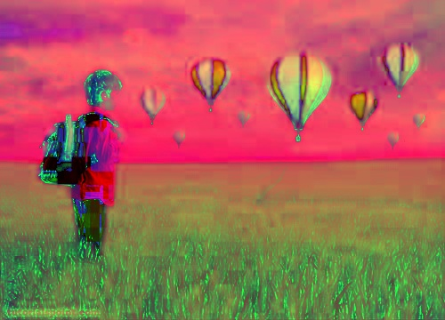

## dip > Robinson.kt
<a href="./src/main/kotlin/dip/Robinson.kt">Robinson.kt</a>
```java
fun main(args: Array<String>) {
    init()
    val kernelSize = 3
    val source = imread("data/dip/grayscale.jpg", IMREAD_GRAYSCALE)
    val destination = Mat(source.rows(), source.cols(), source.type())
    val kernel: Mat = object : Mat(kernelSize, kernelSize, CV_32F) {
        init {
            put(0, 0, -1.0)
            put(0, 1, 0.0)
            put(0, 2, 1.0)
            put(1, 0, - 2.0)
            put(1, 1, 0.0)
            put(1, 2, 2.0)
            put(2, 0, -1.0)
            put(2, 1, 0.0)
            put(2, 2, 1.0)
        }
    }
    filter2D(source, destination, -1, kernel)
    imwrite("out/robinson.jpg", destination)
}
```
**< dip**


**> robinson.jpg**


## dip > ApplyingWatermark.kt
<a href="./src/main/kotlin/dip/ApplyingWatermark.kt">ApplyingWatermark.kt</a>
```java
fun main(args: Array<String>) {
    Origami.init()
    val source = imread("data/dip/digital_image_processing.jpg", IMREAD_COLOR)
    putText(
        source, "dip.hellonico.info", Point((source.rows() / 2).toDouble(), (source.cols() / 2).toDouble()),
        FONT_ITALIC, 1.0, Scalar(255.0)
    )
    imwrite("out/watermarked.jpg", source)
}
```
**< dip**


**> watermarked.jpg**

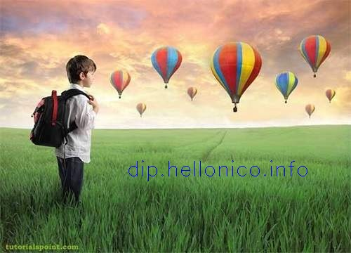

## tutorialpoint > BilateralFilter.kt
<a href="./src/main/kotlin/tutorialpoint/BilateralFilter.kt">BilateralFilter.kt</a>
```java
fun main(args: Array<String>) {
    Origami.init()
    val src = imread("data/marcel2019.jpg")
    val dst = Mat()
    bilateralFilter(src, dst, 15, 80.0, 80.0, Core.BORDER_DEFAULT)
    imwrite("out/bilateral.jpg", dst)
}
```
**< marcel2019.jpg**

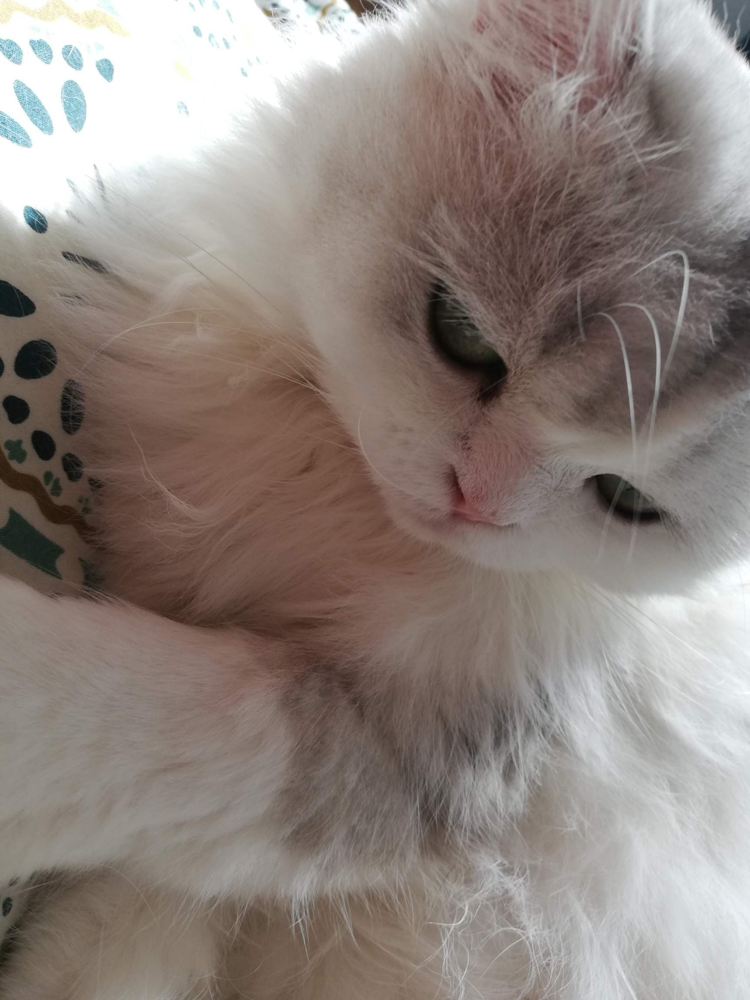

**> bilateral.jpg**


## tutorialpoint > BoxFilter.kt
<a href="./src/main/kotlin/tutorialpoint/BoxFilter.kt">BoxFilter.kt</a>
```java
fun main(args: Array<String>) {
    Origami.init()
    val src = imread("data/marcel2019.jpg")
    val dst = Mat()
    val size = Size(45.0, 45.0)
    val point = Point(-1.0, -1.0)
    boxFilter(src, dst, 50, size, point, true, Core.BORDER_DEFAULT)
    imwrite("out/RboxFilter.jpg", dst)
}
```
**< marcel2019.jpg**


**> RboxFilter.jpg**


## tutorialpoint > SQRBoxFilterTest.kt
<a href="./src/main/kotlin/tutorialpoint/SQRBoxFilterTest.kt">SQRBoxFilterTest.kt</a>
```java
fun main(args: Array<String>) {
    Origami.init()
    val src = imread("data/marcel2019.jpg")
    val dst = Mat()
    sqrBoxFilter(src, dst, -1, Size(1.0, 1.0))
    imwrite("out/sqrBoxFilter.jpg", dst)
}
```
**< marcel2019.jpg**


**> sqrBoxFilter.jpg**

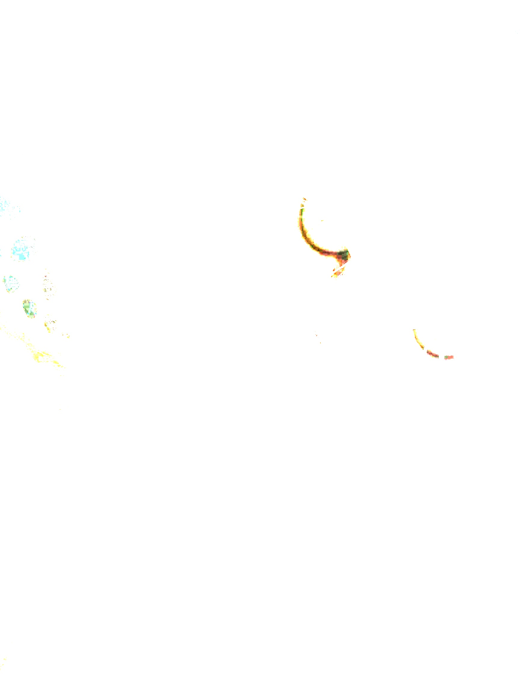

## tutorialpoint > Filter2D.kt
<a href="./src/main/kotlin/tutorialpoint/Filter2D.kt">Filter2D.kt</a>
```java
fun main(args: Array<String>) {
    Origami.init()
    val src = imread("data/marcel2019.jpg")
    val dst = Mat()
    val kernel = Mat.ones(5, 5, CvType.CV_32F)
    for (i in 0 until kernel.rows()) {
        for (j in 0 until kernel.cols()) {
            val m:DoubleArray = kernel[i, j]
            for (k in 1 until m.size) {
                m[k] = m[k] / 2
            }
            kernel.put(i, j, *m)
        }
    }
    println(kernel.dump())
    filter2D(src, dst, -1, kernel)
    imwrite("out/filter2d.jpg", dst)
}
```
**< marcel2019.jpg**


**> filter2d.jpg**

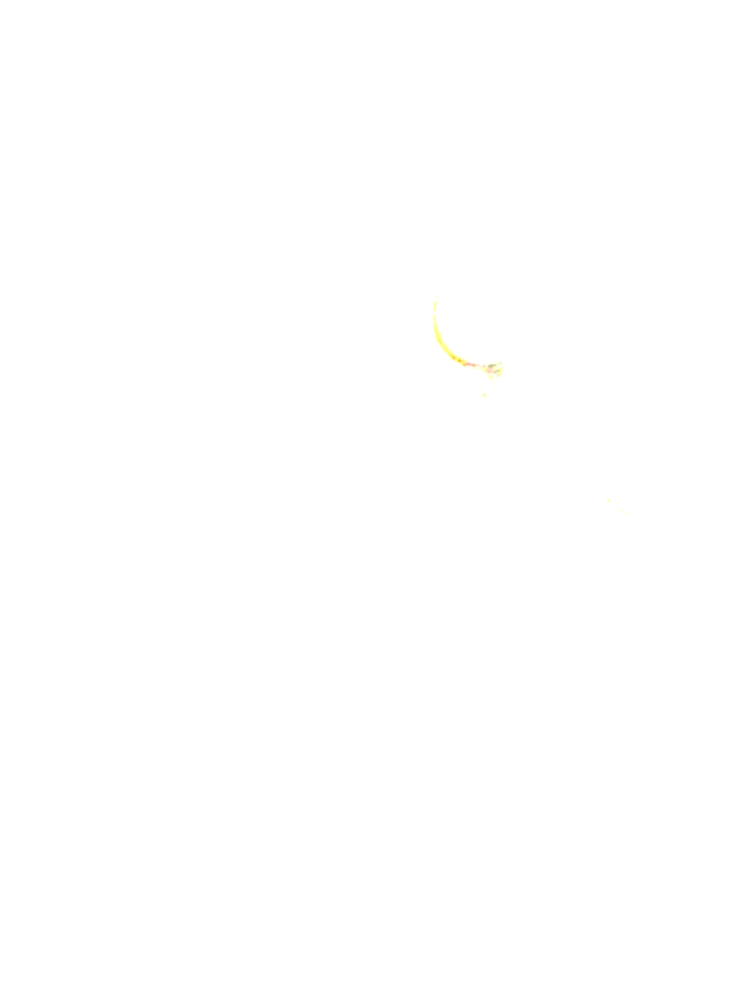

## tutorialpoint > BlurTest.kt
<a href="./src/main/kotlin/tutorialpoint/BlurTest.kt">BlurTest.kt</a>
```java
fun main(args: Array<String>) {
    Origami.init()
    val (src,dst) = listOf(imread("data/marcel.jpg"), Mat())
    blur(src, dst, Size(100.0, 100.0), Point(20.0, 30.0), BORDER_REFLECT)
    imwrite("out/blurtest.jpg", dst)
}
```
**< marcel.jpg**

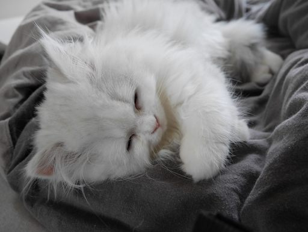

**> blurtest.jpg**

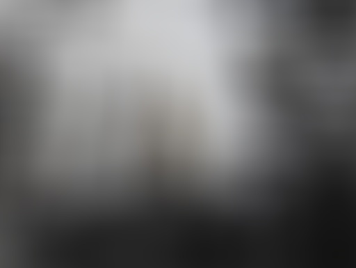

## tutorialpoint > GaussianTest.kt
<a href="./src/main/kotlin/tutorialpoint/GaussianTest.kt">GaussianTest.kt</a>
```java
fun main(args: Array<String>) {
    Origami.init()
    val src = imread("data/marcel2019.jpg")
    val dst = Mat()
    GaussianBlur(src, dst, Size(45.0, 45.0), 0.0)
    imwrite("out/gaussianmarcel.jpg", dst)
}
```
**< marcel2019.jpg**


**> gaussianmarcel.jpg**

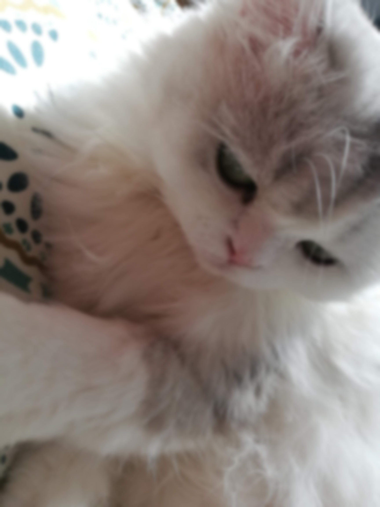

## tutorialpoint > MedianTest.kt
<a href="./src/main/kotlin/tutorialpoint/MedianTest.kt">MedianTest.kt</a>
```java
fun main(args: Array<String>) {
    Origami.init()
    val src = imread("data/marcel2019.jpg")
    val dst = Mat()
    medianBlur(src, dst, 15)
    imwrite("out/medianmarcel.jpg", dst)
}
```
**< marcel2019.jpg**


**> medianmarcel.jpg**


## stackoverflow > OptimizingGrabcut.kt
<a href="./src/main/kotlin/stackoverflow/OptimizingGrabcut.kt">OptimizingGrabcut.kt</a>
```java
fun main(args: Array<String>) {
    Origami.init()
    val mat = imread("data/marcel2019.jpg")
    val result = extractFace(mat, 300, 1200, 300, 900)
    imwrite("out/grabcut.jpg", result)
}
fun extractFace(image: Mat, xOne: Int, xTwo: Int, yOne: Int, yTwo: Int): Mat {
    val rectangle = Rect(xOne, yOne, xTwo, yTwo)
    val result = Mat()
    val bgdModel = Mat()
    val fgdModel = Mat()
    val source = Mat(1, 1, CvType.CV_8U, Scalar(3.0))
    val iteration:Int = 1
    grabCut(image, result, rectangle, bgdModel, fgdModel, iteration, GC_INIT_WITH_RECT)
    compare(result, source, result, CMP_EQ)
    val foreground = Mat(image.size(), CvType.CV_8UC3, Scalar(255.0, 255.0, 255.0))
    image.copyTo(foreground, result)
    return foreground
}
```
**< marcel2019.jpg**


**> grabcut.jpg**

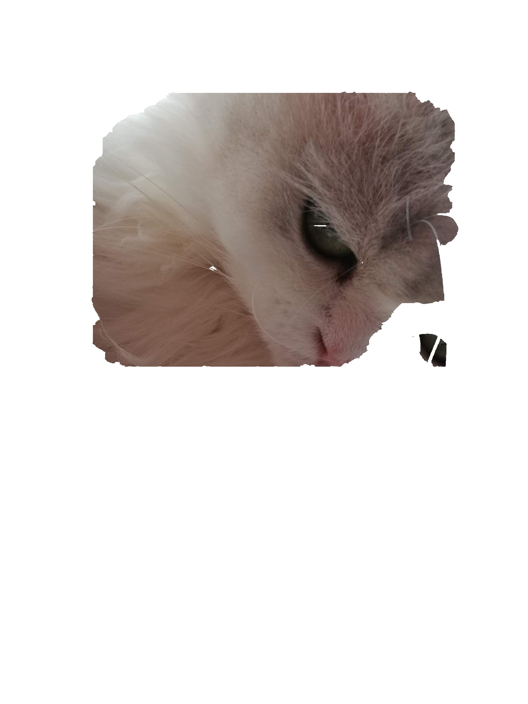

## tanaka79image > GetPixel.kt
<a href="./src/main/kotlin/tanaka79image/GetPixel.kt">GetPixel.kt</a>
```java
fun main(args: Array<String>) {
    Origami.init()
    val im = imread("data/lupin3.jpeg") // 入力画像の取得
    // RGBカラー画像の画素値を取得
    var data = DoubleArray(3)
    data = im[100, 200]
    println("Blue：" + data[0])
    println("Green：" + data[1])
    println("Red：" + data[2])
    // グレースケール画像の画素値を取得
    val gray = Mat()
    cvtColor(im, gray, COLOR_RGB2GRAY) // 画像のグレースケール変換
    var data2 = DoubleArray(1)
    data2 = gray[100, 200]
    println("Gray：" + data2[0])
}
```
**< lupin3.jpeg**


## tanaka79image > Trimming.kt
<a href="./src/main/kotlin/tanaka79image/Trimming.kt">Trimming.kt</a>
```java
fun main(args: Array<String>) {
    Origami.init()
    // 入力画像の取得
    val im = imread("data/lupin3.jpeg")
    val roi = Rect(280, 60, 120, 100)
    val im2 = Mat(im, roi)
    // 結果を保存
    imwrite("out/tanaka_trimming.png", im2)
}
```
**< lupin3.jpeg**


**> tanaka_trimming.png**

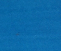

## tanaka79image > DetectHSV.kt
<a href="./src/main/kotlin/tanaka79image/DetectHSV.kt">DetectHSV.kt</a>
```java
fun main(args: Array<String>) {
    Origami.init()
    val im = imread("data/lupin3.jpeg") // 入力画像の取得
    val hsv = Mat()
    val mask = Mat()
    val im2 = Mat()
    cvtColor(im, hsv, COLOR_BGR2HSV) // HSV色空間に変換
    inRange(hsv, Scalar(100.0, 10.0, 0.0), Scalar(140.0, 255.0, 255.0), mask) // 緑色領域のマスク作成
    im.copyTo(im2, mask) // マスクを 用いて入力画像から緑色領域を抽出
    imwrite("out/tanakahsvmask.jpg", im2) // 画像の出力
    bitwise_not(mask, mask)
    val im3 = Mat()
    im.copyTo(im3, mask) // マスクを 用いて入力画像から緑色領域を抽出
    imwrite("out/tanakahsv.jpg", im3) // 画像の出力
}
```
**< lupin3.jpeg**


**> tanakahsvmask.jpg**

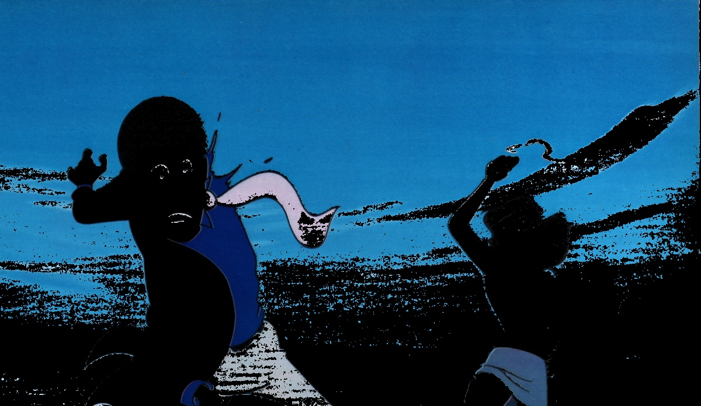

**> tanakahsv.jpg**

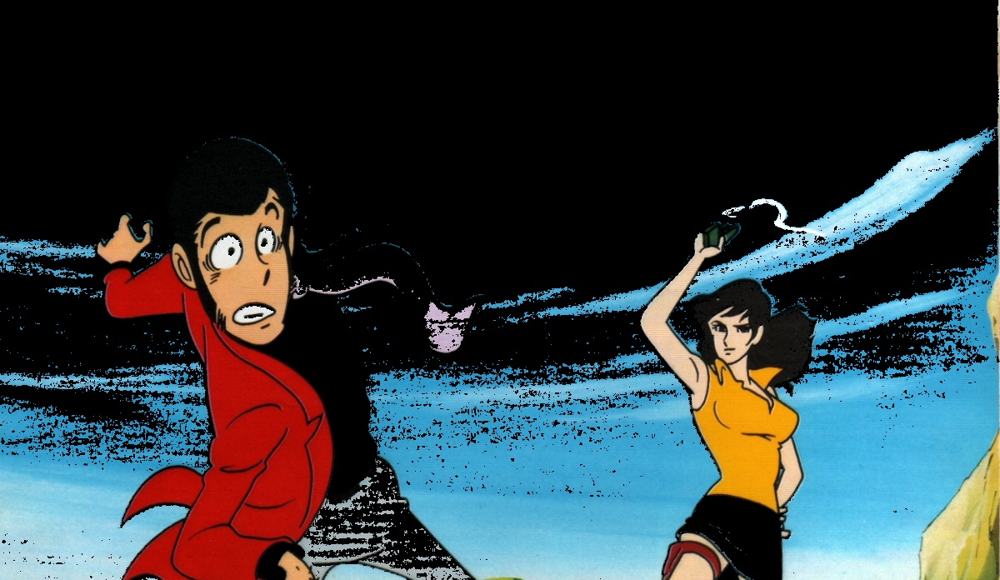

## tanaka79image > Mosaic.kt
<a href="./src/main/kotlin/tanaka79image/Mosaic.kt">Mosaic.kt</a>
```java
fun main(args: Array<String>) {
    Origami.init()
    val im = imread("data/lupin3.jpeg") // 入力画像の取得
    resize(im, im, Size(), 0.1, 0.1, INTER_NEAREST) // 画像サイズを1/10倍
    resize(im, im, Size(), 10.0, 10.0, INTER_NEAREST) // 画像サイズを10倍
    imwrite("out/tanaka_mosaic.jpg", im) // 画像の出力
}
```
**< lupin3.jpeg**


**> tanaka_mosaic.jpg**


## tanaka79image > Gamma.kt
<a href="./src/main/kotlin/tanaka79image/Gamma.kt">Gamma.kt</a>
```java
fun main(args: Array<String>) {
    Origami.init()
    val im = imread("data/lupin3.jpeg") // 入力画像の取得
    val gamma = 1.0 // ガンマ定数
    // ルックアップテーブルの計算
    val lut = Mat(1, 256, CvType.CV_8UC1) //　ルックアップテーブル作成
    lut.setTo(Scalar(0.0))
    for (i in 0..255) {
        lut.put(0, i, Math.pow(1.0 * i / 255, 1 / gamma) * 255)
    }
    // ガンマ変換
    Core.LUT(im, lut, im)
    // 画像の出力
    imwrite("out/tanaka_gamma.jpg", im)
}
```
**< lupin3.jpeg**


**> tanaka_gamma.jpg**

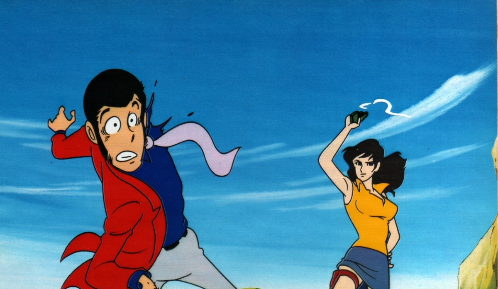

## tanaka79image > Grabcut.kt
<a href="./src/main/kotlin/tanaka79image/Grabcut.kt">Grabcut.kt</a>
```java
fun main(args: Array<String>) {
    Origami.init()
    val im = imread("data/lupin3.jpeg") // 入力画像の取得
    val mask = Mat() // マスク画像用
    val bgModel = Mat() // 背景モデル用
    val fgModel = Mat() // 前景モデル用
    val rect = Rect(10, 10, 250, 290) // 大まかな前景と背景の境目(矩形)
    val source = Mat(1, 1, CvType.CV_8U, Scalar(3.0))
    grabCut(im, mask, rect, bgModel, fgModel, 1, 0) // グラフカットで前景と背景を分離
    Core.compare(mask, source, mask, Core.CMP_EQ)
    val fg = Mat(im.size(), CvType.CV_8UC1, Scalar(0.0, 0.0, 0.0)) // 前景画像用
    im.copyTo(fg, mask) // 前景画像の作成
    imwrite("out/tanaka_grabcut.jpg", fg) // 画像の出力
}
```
**< lupin3.jpeg**


**> tanaka_grabcut.jpg**

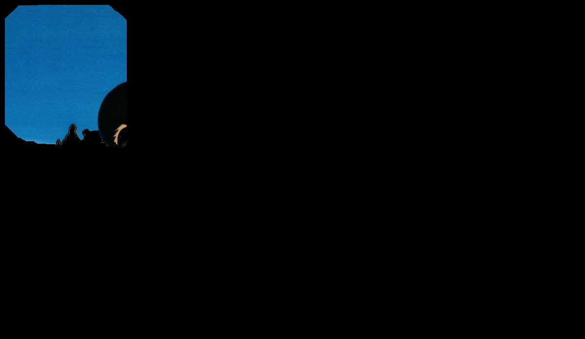

## tanaka79image > FastNlMeans.kt
<a href="./src/main/kotlin/tanaka79image/FastNlMeans.kt">FastNlMeans.kt</a>
```java
fun main(args: Array<String>) {
    Origami.init()
    val im = imread("data/lupin3.jpeg") // 入力画像の取得
    Photo.fastNlMeansDenoising(im, im)
    imwrite("out/tanaka_denoising.jpg", im) // 画像の出力
}
```
**< lupin3.jpeg**


**> tanaka_denoising.jpg**


## tanaka79image > EqualizeHistgram.kt
<a href="./src/main/kotlin/tanaka79image/EqualizeHistgram.kt">EqualizeHistgram.kt</a>
```java
fun main(args: Array<String>) {
    Origami.init()
    val im = imread("data/lupin3.jpeg") // 入力画像の取得
    val gray = Mat()
    cvtColor(im, gray, COLOR_RGB2GRAY) // 画像のグレースケール変換
    equalizeHist(gray, gray) // グレースケール画像のヒストグラムを平坦化
    imwrite("out/tanaka_hist.jpg", gray) // 画像の出力
}
```
**< lupin3.jpeg**


**> tanaka_hist.jpg**

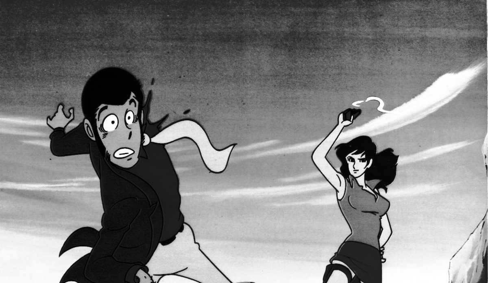

## tanaka79image > TemplateMatching.kt
<a href="./src/main/kotlin/tanaka79image/TemplateMatching.kt">TemplateMatching.kt</a>
```java
fun main(args: Array<String>) {
    Origami.init()
    val im = imread("data/lupin3.jpeg") // 入力画像の取得
    val tmp = imread("data/lupin_head.jpg") // テンプレート画像の取得
    val result = Mat()
    matchTemplate(im, tmp, result, TM_CCOEFF_NORMED) //テンプレートマッチング
    threshold(result, result, 0.8, 1.0, THRESH_TOZERO) // 検出結果から相関係数がしきい値以下の部分を削除
    // テンプレート画像の部分を元画像に赤色の矩形で囲む
    for (i in 0 until result.rows()) {
        for (j in 0 until result.cols()) {
            if (result[i, j][0] > 0) {
                rectangle(
                    im,
                    Point(j.toDouble(), i.toDouble()),
                    Point((j + tmp.cols()).toDouble(), (i + tmp.rows()).toDouble()),
                    Scalar(0.0, 0.0, 255.0)
                )
            }
        }
    }
    imwrite("out/tanaka_match.jpg", im) // 画像の出力
}
```
**< lupin3.jpeg**


**< lupin_head.jpg**

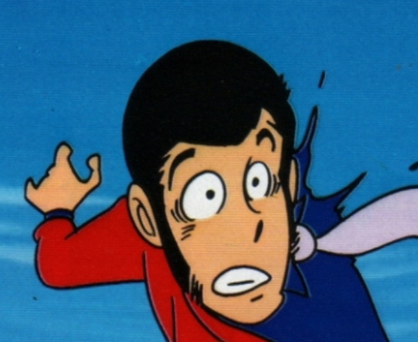

**> tanaka_match.jpg**


## tanaka79image > Canny.kt
<a href="./src/main/kotlin/tanaka79image/Canny.kt">Canny.kt</a>
```java
fun main(args: Array<String>) {
    Origami.init()
    val im = imread("data/lupin3.jpeg") // 入力画像の取得
    val gray = Mat()
    cvtColor(im, gray, COLOR_RGB2GRAY) // グレースケール変換
    Canny(gray, gray, 400.0, 500.0, 5, true) // Cannyアルゴリズムで輪郭検出
    imwrite("out/tanaka_canny.jpg", gray) // エッジ画像の出力
}
```
**< lupin3.jpeg**


**> tanaka_canny.jpg**

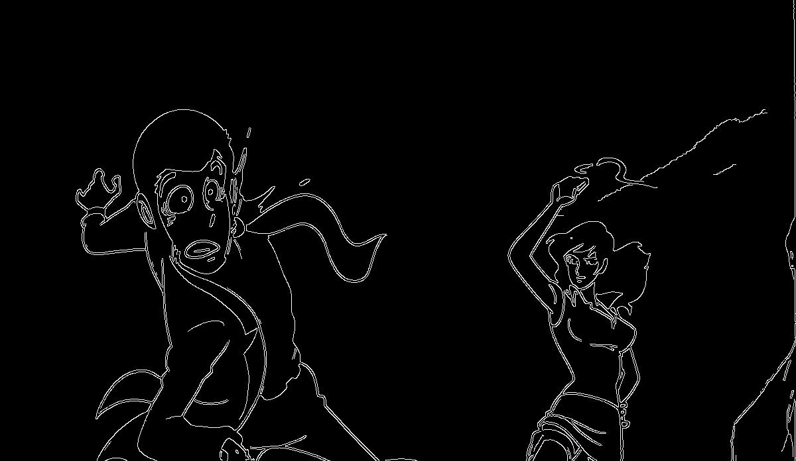

## me > hello.kt
<a href="./src/main/kotlin/me/hello.kt">hello.kt</a>
```java
fun main(args: Array<String>) {
    Origami.init()
    val hello = eye(3, 3, CV_8UC1)
    println(hello.dump())
}
```
## me > BodyTransfer.kt
<a href="./src/main/kotlin/me/BodyTransfer.kt">BodyTransfer.kt</a>
```java
const val DEFAULT_CLASSIFIER =
    "https://raw.githubusercontent.com/opencv/opencv/master/data/haarcascades/haarcascade_upperbody.xml"
const val DEFAULT_IMAGE = "https://www.netclipart.com/pp/m/106-1066497_suit-man-png-man-in-suit-png.png"
const val CLASSIFIER_PATH = "haarcascade.xml"
val COLOR = Scalar(0.0, 100.0, 0.0)
fun main(args: Array<String>) {
    Origami.init()
    val imageUrl = if (args.size >= 1 && args[0] != null) args[0] else DEFAULT_IMAGE
    val classifierUrl = if (args.size >= 2 && args[1] != null) args[1] else DEFAULT_CLASSIFIER
    Downloader.transfer(imageUrl, "data/image.jpg")
    Downloader.transfer(classifierUrl, CLASSIFIER_PATH)
    val classifier = CascadeClassifier()
    classifier.load(CLASSIFIER_PATH)
    val mat = imread("data/image.jpg")
    val bodies = MatOfRect()
    classifier.detectMultiScale(mat, bodies)
    for (body in bodies.toList()) {
        Imgproc.rectangle(
            mat,
            Point(body.x.toDouble(), body.y.toDouble()),
            Point((body.x + body.width).toDouble(), (body.y + body.height).toDouble()),
            COLOR,
            3
        )
    }
    imwrite("out/bodytransfer.jpg", mat)
}
```
**< image.jpg**


**> bodytransfer.jpg**

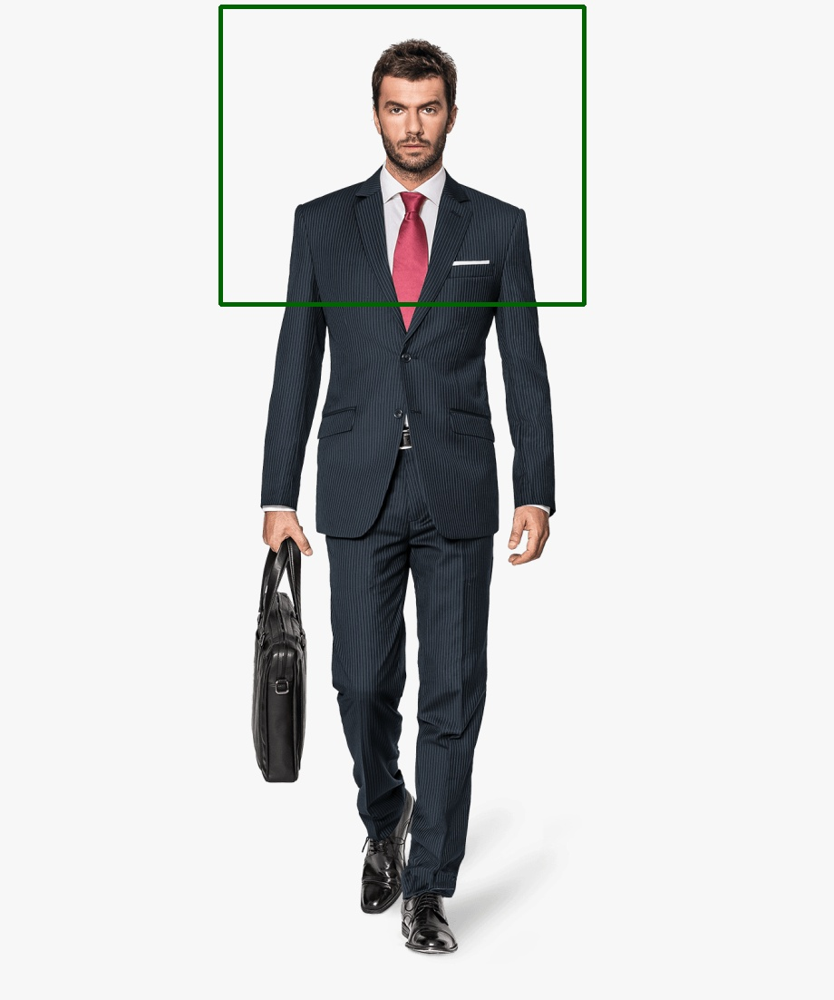

## geeksforgeeks > InPainting.kt
<a href="./src/main/kotlin/geeksforgeeks/InPainting.kt">InPainting.kt</a>
```java
/**
 * https://www.geeksforgeeks.org/introduction-to-opencv/
 */
fun main(args: Array<String>) {
    Origami.init()
    val img = imread("data/geeksforgeeks/cat_damaged.png")
    val mask = imread("data/geeksforgeeks/cat_mask.png", 0)
    val dst = Mat()
    inpaint(img, mask, dst, 3.0, INPAINT_NS)
    imwrite("out/cat_inpainted.png", dst)
}
```
**< geeksforgeeks**

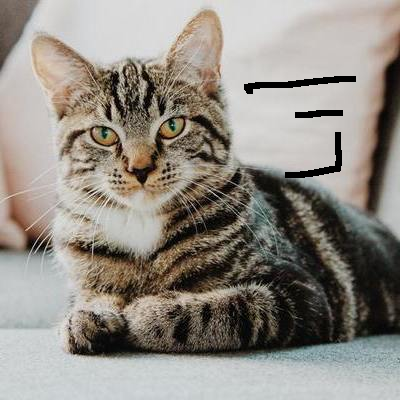

**< geeksforgeeks**

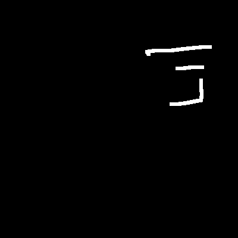

**> cat_inpainted.png**

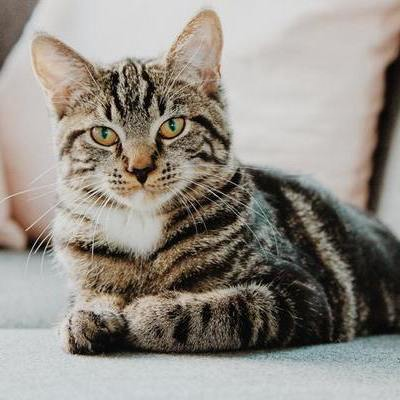

## tanaka79 > Level.kt
<a href="./src/main/kotlin/tanaka79/Level.kt">Level.kt</a>
```java
fun main(args: Array<String>) {
    Origami.init()
    val im = imread("data/lupin3.jpeg") // 入力画像の取得
    val n = 100 // 大きいほど階調数が減少
    // 減色処理
    val sz = im.size()
    var i = 0
    while (i < sz.height) {
        var j = 0
        while (j < sz.width) {
            val pixcel = im[i, j]
            pixcel[0] = (pixcel[0].toInt() / n * n + n / 2).toDouble()
            pixcel[1] = (pixcel[1].toInt() / n * n + n / 2).toDouble()
            pixcel[2] = (pixcel[2].toInt() / n * n + n / 2).toDouble()
            im.put(i, j, *pixcel)
            j++
        }
        i++
    }
    imwrite("out/tanaka_level.jpg", im) // 画像データをJPG形式で保存
}
```
**< lupin3.jpeg**


**> tanaka_level.jpg**

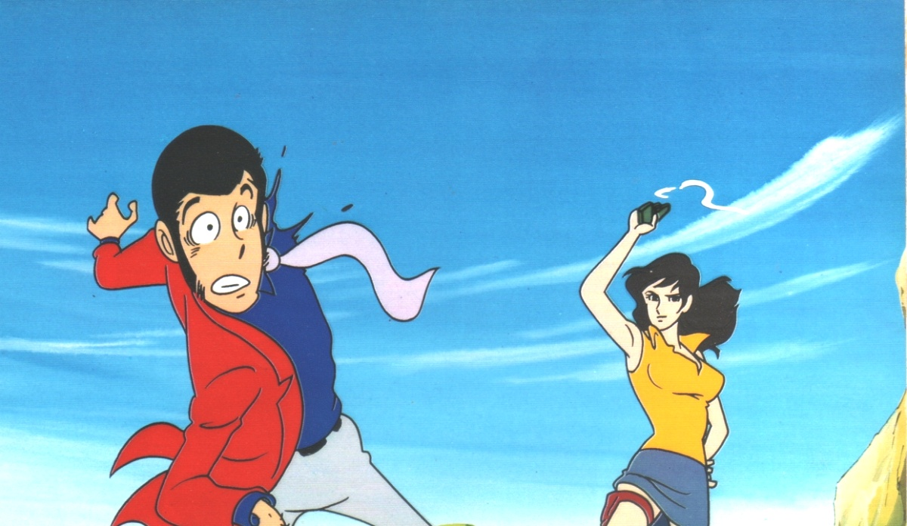

## tanaka79 > MedianBlur.kt
<a href="./src/main/kotlin/tanaka79/MedianBlur.kt">MedianBlur.kt</a>
```java
fun main(args: Array<String>) {
    Origami.init()
    val im = imread("data/lupin3.jpeg") // 入力画像の取得
    val dst = Mat()
    medianBlur(im, dst, 5)
    imwrite("out/tanaka_median.jpg", dst) // 出力画像の保存
}
```
**< lupin3.jpeg**


**> tanaka_median.jpg**

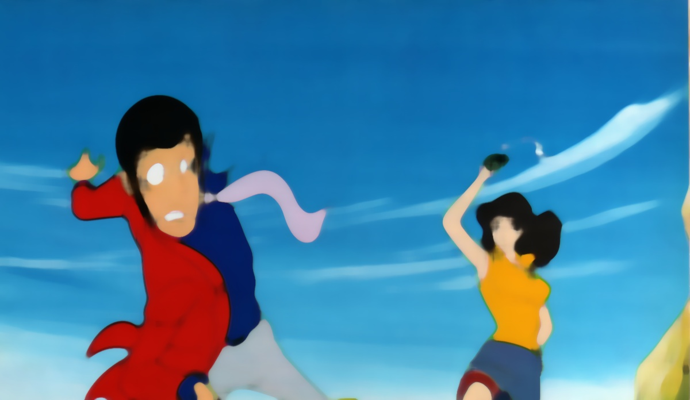

## tanaka79 > HoughLinesP.kt
<a href="./src/main/kotlin/tanaka79/HoughLinesP.kt">HoughLinesP.kt</a>
```java
fun main(args: Array<String>) {
    Origami.init()
    val im = imread("data/lupin3.jpeg") // 入力画像の取得
    val gray = Mat(im.rows(), im.cols(), CvType.CV_8SC1)
    cvtColor(im, gray, COLOR_RGB2GRAY) // グレースケール変換
    Canny(gray, gray, 80.0, 100.0) // 輪郭線検出
    val lines = Mat()
    // 確率的ハフ変換で直線検出
    HoughLinesP(gray, lines, 1.0, Math.PI / 180, 50, 100.0, 50.0)
    var data: DoubleArray
    val pt1 = Point()
    val pt2 = Point()
    // 検出した直線上を赤線で塗る
    for (i in 0 until lines.cols()) {
        data = lines[0, i]
        pt1.x = data[0]
        pt1.y = data[1]
        pt2.x = data[2]
        pt2.y = data[3]
        line(im, pt1, pt2, Scalar(0.0, 0.0, 200.0), 3)
    }
    imwrite("out/tanaka_houghlinesp.jpg", im) // 出力画像の保存
}
```
**< lupin3.jpeg**


**> tanaka_houghlinesp.jpg**


## tanaka79 > Sobel.kt
<a href="./src/main/kotlin/tanaka79/Sobel.kt">Sobel.kt</a>
```java
fun main(args: Array<String>) {
    Origami.init()
    val gray = imread("data/lupin3.jpeg", 0)
    Sobel(gray, gray, gray.depth(), 2, 2)
    imwrite("out/tanaka_sobel.jpg", gray)
}
```
**< lupin3.jpeg**


**> tanaka_sobel.jpg**

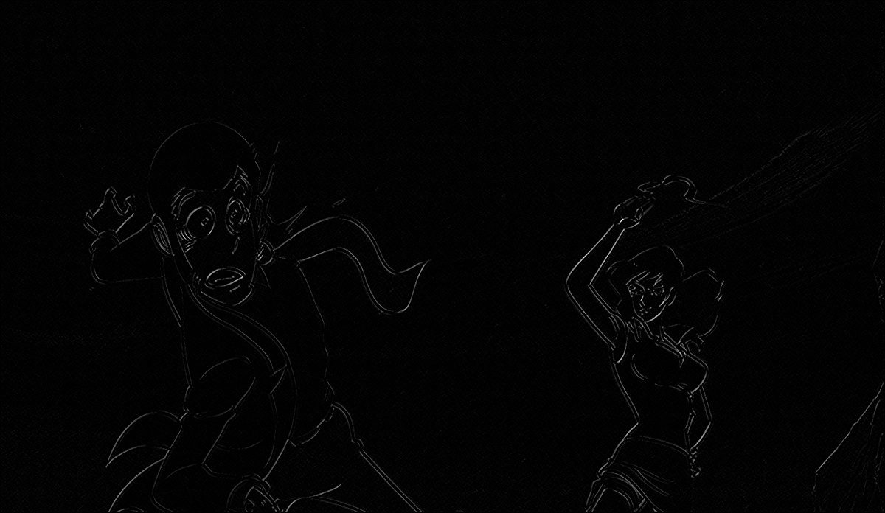

## tanaka79 > Cluster.kt
<a href="./src/main/kotlin/tanaka79/Cluster.kt">Cluster.kt</a>
```java
fun main(args: Array<String>) {
    Origami.init()
    val img = imread("data/lupin3.jpeg") // 入力画像の取得
    val k = 2
    val clusters = cluster(img, k)[0]
    imwrite("out/tanaka_cluster.png", clusters) // 画像をJPG形式で保存
}
fun cluster(cutout: Mat, k: Int): List<Mat> {
    val samples = cutout.reshape(1, cutout.cols() * cutout.rows())
    val samples32f = Mat()
    samples.convertTo(samples32f, CvType.CV_32F, 1.0 / 255.0)
    val labels = Mat()
    val criteria = TermCriteria(TermCriteria.COUNT, 100, 1.0)
    val centers = Mat()
    Core.kmeans(samples32f, k, labels, criteria, 1, Core.KMEANS_PP_CENTERS, centers)
    return showClusters(cutout, labels, centers)
}
private fun showClusters(cutout: Mat, labels: Mat, centers: Mat): List<Mat> {
    centers.convertTo(centers, CvType.CV_8UC1, 255.0)
    centers.reshape(3)
    val clusters: MutableList<Mat> = ArrayList()
    for (i in 0 until centers.rows()) {
        clusters.add(Mat.zeros(cutout.size(), cutout.type()))
    }
    val counts: MutableMap<Int, Int> = HashMap()
    for (i in 0 until centers.rows()) counts[i] = 0
    var rows = 0
    for (y in 0 until cutout.rows()) {
        for (x in 0 until cutout.cols()) {
            val label = labels[rows, 0][0].toInt()
            val r = centers[label, 2][0].toInt()
            val g = centers[label, 1][0].toInt()
            val b = centers[label, 0][0].toInt()
            clusters[label].put(y, x, b.toDouble(), g.toDouble(), r.toDouble())
            rows++
        }
    }
    return clusters
}
```
**< lupin3.jpeg**


**> tanaka_cluster.png**

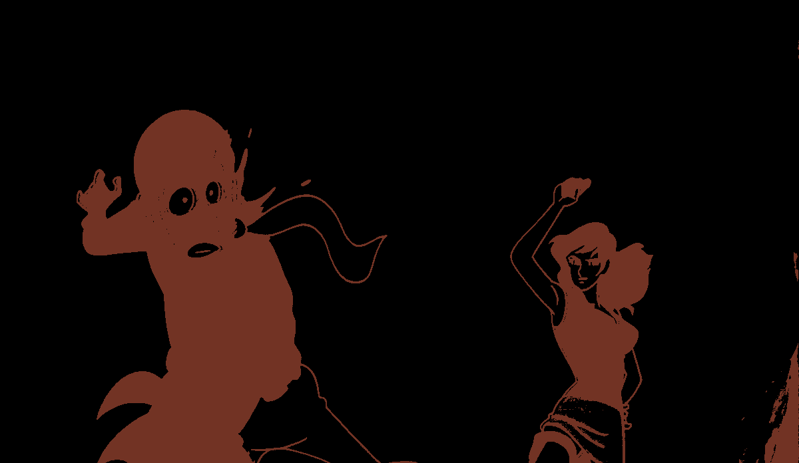

## tanaka79 > Resize.kt
<a href="./src/main/kotlin/tanaka79/Resize.kt">Resize.kt</a>
```java
fun main(args: Array<String>) {
    Origami.init()
    val im = imread("data/lupin3.jpeg") // 入力画像の取得
    val im2 = Mat()
    val im3 = Mat()
    val sz = im.size()
    resize(im, im2, Size(sz.width * 2, sz.height * 2)) // 2倍拡大
    resize(im, im3, Size(sz.width * 0.5, sz.height * 0.5)) // 1/2倍に縮小
    imwrite("out/tanaka_resize2.jpg", im2) // 出力画像の保存
    imwrite("out/tanaka_resize05.jpg", im3) // 出力画像の保存
}
```
**< lupin3.jpeg**


**> tanaka_resize2.jpg**


**> tanaka_resize05.jpg**


## tanaka79 > HoughLines.kt
<a href="./src/main/kotlin/tanaka79/HoughLines.kt">HoughLines.kt</a>
```java
fun main(args: Array<String>) {
    Origami.init()
    val im = imread("data/lupin3.jpeg") // 入力画像の取得
    val gray = Mat(im.rows(), im.cols(), CvType.CV_8SC1)
    cvtColor(im, gray, COLOR_RGB2GRAY) // グレースケール変換
    Canny(gray, gray, 70.0, 110.0) // 輪郭線検出
    val lines = Mat()
    // 古典的ハフ変換で直線検出
    HoughLines(gray, lines, 1.0, 2 * Math.PI / 180, 20)
    // 検出した直線上を赤線で塗る
    for (i in 0 until lines.cols()) {
        val data = lines[0, i]
        val rho = data[0]
        val theta = data[1]
        val cosTheta = Math.cos(theta)
        val sinTheta = Math.sin(theta)
        val x0 = cosTheta * rho
        val y0 = sinTheta * rho
        val pt1 = Point(x0 + 10000 * -sinTheta, y0 + 10000 * cosTheta)
        val pt2 = Point(x0 - 10000 * -sinTheta, y0 - 10000 * cosTheta)
        line(im, pt1, pt2, Scalar(0.0, 0.0, 200.0), 3)
    }
    imwrite("out/tanaka_houghlines.jpg", im) // 出力画像の保存
}
```
**< lupin3.jpeg**


**> tanaka_houghlines.jpg**


## tanaka79 > BoxFilter.kt
<a href="./src/main/kotlin/tanaka79/BoxFilter.kt">BoxFilter.kt</a>
```java
fun main(args: Array<String>) {
    Origami.init()
    val im = imread("data/lupin3.jpeg") // 入力画像の取得
    val dst = Mat()
    blur(im, dst, Size(5.0, 5.0))
    imwrite("out/tanaka_blur.jpg", dst) // 出力画像の保存
}
```
**< lupin3.jpeg**


**> tanaka_blur.jpg**


## tanaka79 > Invert.kt
<a href="./src/main/kotlin/tanaka79/Invert.kt">Invert.kt</a>
```java
fun main(args: Array<String>) {
    Origami.init()
    val im = imread("data/lupin3.jpeg") // 入力画像の取得
    Core.bitwise_not(im, im) // 色反転(Not演算)
    imwrite("out/tanaka_invert.jpg", im) // 出力画像の保存
}
```
**< lupin3.jpeg**


**> tanaka_invert.jpg**

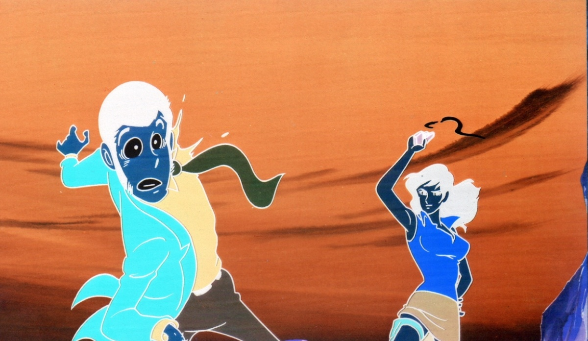

## tanaka79 > AnimeFaceDetect.kt
<a href="./src/main/kotlin/tanaka79/AnimeFaceDetect.kt">AnimeFaceDetect.kt</a>
```java
fun main(args: Array<String>) {
    Origami.init()
    // 入力画像の取得
    val im = imread("data/lupin3.jpeg")
    // カスケード分類器でアニメ顔探索
    val faceDetector = CascadeClassifier("data/nagadomi/lbpcascade_animeface.xml")
    val faceDetections = MatOfRect()
    faceDetector.detectMultiScale(im, faceDetections)
    // 見つかったアニメ顔を矩形で囲む
    for (rect in faceDetections.toArray()) {
        rectangle(
            im,
            Point(rect.x.toDouble(), rect.y.toDouble()),
            Point((rect.x + rect.width).toDouble(), (rect.y + rect.height).toDouble()),
            Scalar(0.0, 0.0, 255.0),
            5
        )
    }
    // 結果を保存
    imwrite("out/anime_face.png", im)
}
```
**< lupin3.jpeg**


**> anime_face.png**

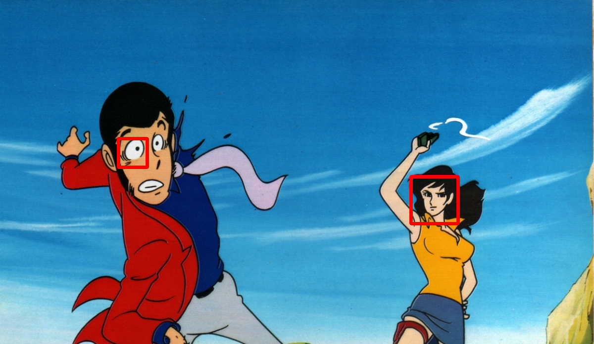

## tanaka79 > HoughCircles.kt
<a href="./src/main/kotlin/tanaka79/HoughCircles.kt">HoughCircles.kt</a>
```java
fun main(args: Array<String>) {
    Origami.init()
    val im = imread("data/lupin3.jpeg") // 入力画像の取得
    val gray = Mat(im.rows(), im.cols(), CvType.CV_8SC1)
    cvtColor(im, gray, COLOR_RGB2GRAY) // グレースケール変換
    //Imgproc.Canny(gray, gray, 80, 100);										// 輪郭線検出
    val circles = Mat()
    // ハフ変換で円検出
    HoughCircles(gray, circles, CV_HOUGH_GRADIENT, 2.0, 10.0, 160.0, 50.0, 10, 20)
    val pt = Point()
    // 検出した直線上を赤線で塗る
    for (i in 0 until circles.cols()) {
        val data = circles[0, i]
        pt.x = data[0]
        pt.y = data[1]
        val rho = data[2]
        circle(im, pt, rho.toInt(), Scalar(0.0, 200.0, 0.0), 5)
    }
    imwrite("out/tanaka_circles.jpg", im) // 出力画像の保存
}
```
**< lupin3.jpeg**


**> tanaka_circles.jpg**

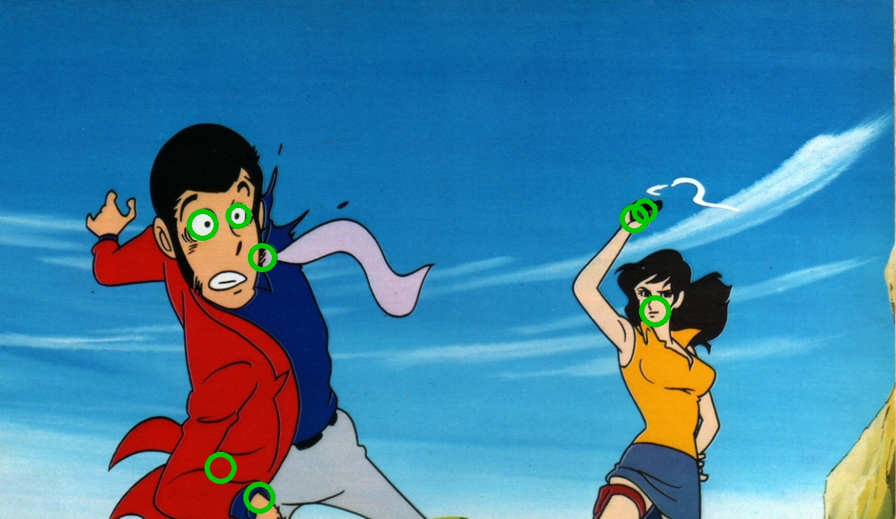

## tanaka79 > Sift.kt
<a href="./src/main/kotlin/tanaka79/Sift.kt">Sift.kt</a>
```java
fun main(args: Array<String>) {
    Origami.init()
    val im = imread("data/lupin3.jpeg") // 入力画像の取得
    val gray = Mat()
    cvtColor(im, gray, COLOR_RGB2GRAY) // 画像のグレースケール変換
    // ------ SIFTの処理 ここから ------
    val siftDetector = SIFT.create()
    val kp = MatOfKeyPoint()
    siftDetector.detect(gray, kp)
    // -- Draw keypoints
    Features2d.drawKeypoints(im, kp, im)
    imwrite("out/tanaka_sift.jpg", im) // 画像の出力
}
```
**< lupin3.jpeg**


**> tanaka_sift.jpg**

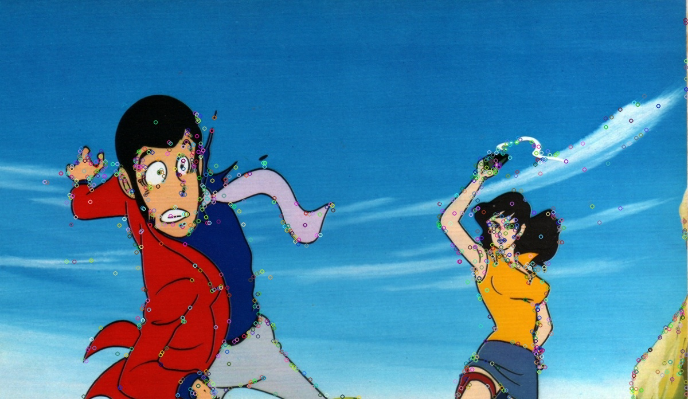

## tanaka79 > FaceDetect.kt
<a href="./src/main/kotlin/tanaka79/FaceDetect.kt">FaceDetect.kt</a>
```java
fun main(args: Array<String>) {
    Origami.init()
    // 入力画像の取得
    val im = Imgcodecs.imread("data/lupin3.jpeg")
    // カスケード分類器で顔探索
    val faceDetector = CascadeClassifier("data/haarcascades/haarcascade_frontalface_alt.xml")
    val faceDetections = MatOfRect()
    faceDetector.detectMultiScale(im, faceDetections)
    // 見つかった顔を矩形で囲む
    for (rect in faceDetections.toArray()) {
        Imgproc.rectangle(
            im,
            Point(rect.x.toDouble(), rect.y.toDouble()),
            Point((rect.x + rect.width).toDouble(), (rect.y + rect.height).toDouble()),
            Scalar(0.0, 0.0, 255.0),
            5
        )
    }
    // 結果を保存
    Imgcodecs.imwrite("out/tanaka_face.jpg", im)
}
```
**< lupin3.jpeg**


**> tanaka_face.jpg**

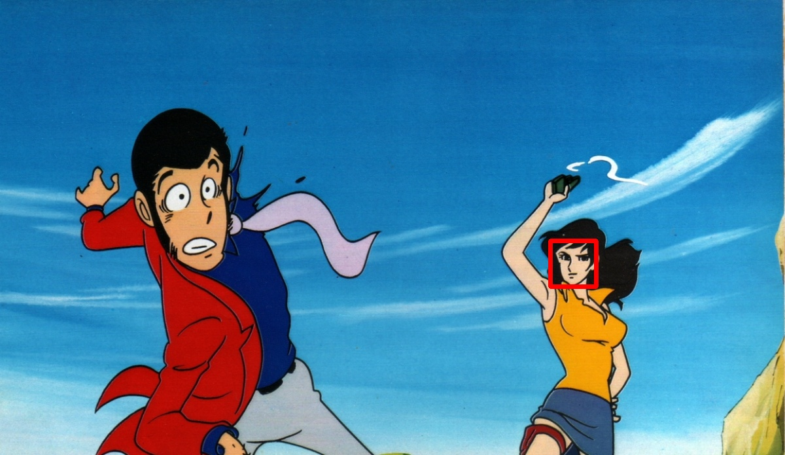

## tanaka79 > Laplacian.kt
<a href="./src/main/kotlin/tanaka79/Laplacian.kt">Laplacian.kt</a>
```java
fun main(args: Array<String>) {
    Origami.init()
    val gray = imread("data/lupin3.jpeg", 0)
    Laplacian(gray, gray, gray.depth())
    imwrite("out/tanaka_laplacian.jpg", gray)
}
```
**< lupin3.jpeg**


**> tanaka_laplacian.jpg**

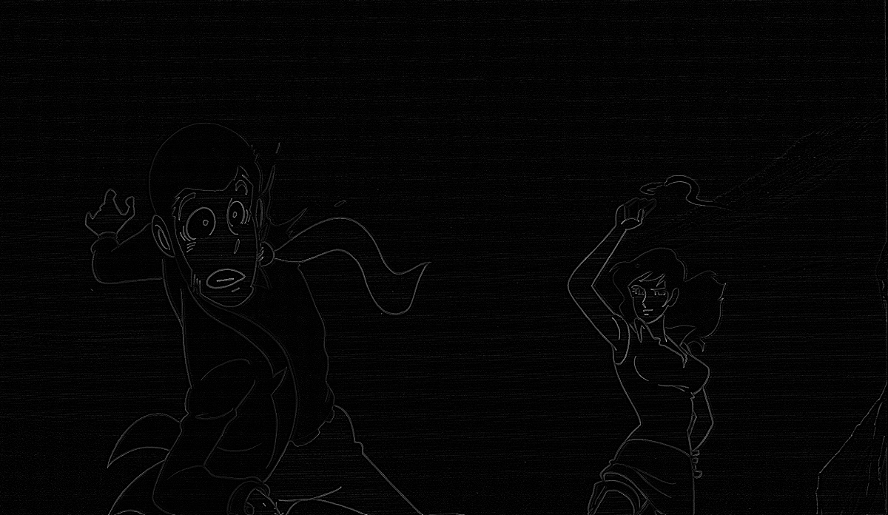

## tanaka79 > Canny.kt
<a href="./src/main/kotlin/tanaka79/Canny.kt">Canny.kt</a>
```java
fun main(args: Array<String>) {
    Origami.init()
    val gray = imread("data/lupin3.jpeg", 0) // 入力画像の取得
    Canny(gray, gray, 100.0, 200.0, 3, true)
    imwrite("out/tanaka_canny.jpg", gray) // 画像データをJPG形式で保存
}
```
**< lupin3.jpeg**


**> tanaka_canny.jpg**


## webcam > simple.kt
<a href="./src/main/kotlin/webcam/simple.kt">simple.kt</a>
```java
fun main(args: Array<String>) {
    init()
    Camera().run()
}
```
## webcam > simpleWithFilter.kt
<a href="./src/main/kotlin/webcam/simpleWithFilter.kt">simpleWithFilter.kt</a>
```java
fun main(args: Array<String>) {
    init()
    Camera().filter(Function { im ->
        val (temp,target) = listOf(Mat(), Mat())
        val dx = 16.0
        resize(im, temp, Size(dx, dx), 1.0, 1.0, INTER_LINEAR)
        resize(temp, target, im.size(), 1.0, 1.0, INTER_NEAREST)
        target
    }).run()
}
```
