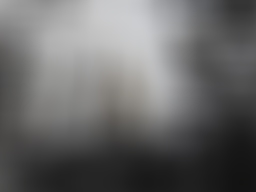

## tobybreckon > backgroundModel.kt
<a href="./src/main/kotlin/tobybreckon/backgroundModel.kt">backgroundModel.kt</a>
```java
fun main(args: Array<String>) {
    Origami.init()
    val foreground = Mat()
    val fg_mask = Mat()
    val MoG = Video.createBackgroundSubtractorMOG2()
    Camera().device(0).filter(Filter()
        {
            MoG.apply(it, fg_mask, 0.1)
            cvtColor(fg_mask, fg_mask, COLOR_GRAY2BGR)
            bitwise_and(it, fg_mask, foreground)
            foreground
        }
    ).run()
}
```
## tobybreckon > hogPeopleDetection.kt
<a href="./src/main/kotlin/tobybreckon/hogPeopleDetection.kt">hogPeopleDetection.kt</a>
```java
fun main(args: Array<String>) {
    Origami.init()
    val HOG = HOGDescriptor()
    HOG.setSVMDetector(HOGDescriptor.getDefaultPeopleDetector())
    val foundLocations = MatOfRect()
    val foundWeights = MatOfDouble()
    val color = Scalar(255.0, 0.0, 0.0)
    Camera().device(0).filter(Filter() {
        HOG.detectMultiScale(
            it, foundLocations, foundWeights, 0.0, Size(8.0, 8.0), Size(32.0, 32.0),
            1.05, 8.0, false
        )
        drawLocations(foundLocations, it, color)
    }).run()
}
private fun drawLocations(foundLocations: MatOfRect, it: Mat?, color: Scalar): Mat? {
    val rectangles = foundLocations.toList()
    for (i in rectangles.indices) {
        rectangle(
            it, Point(rectangles[i].x.toDouble(), rectangles[i].y.toDouble()),
            Point(
                (rectangles[i].x + rectangles[i].width).toDouble(),
                (rectangles[i].y + rectangles[i].height).toDouble()
            ),
            color, 2, 1, 0
        )
    }
    return it
}
```
## dip > ApplyingBoxFilter.kt
<a href="./src/main/kotlin/dip/ApplyingBoxFilter.kt">ApplyingBoxFilter.kt</a>
```java
fun createKernelOfSize(kernelSize: Int): Mat {
    val kernel = Mat.ones(kernelSize, kernelSize, CvType.CV_32F)
    for (i in 0 until kernel.rows()) {
        for (j in 0 until kernel.cols()) {
            val m = kernel[i, j]
            for (k in m.indices) {
                m[k] = m[k] / (kernelSize * kernelSize)
            }
            kernel.put(i, j, *m)
        }
    }
    return kernel
}
fun main(args: Array<String>) {
    Origami.init()
    val source = imread("data/dip/grayscale.jpg", IMREAD_GRAYSCALE)
    val destination = Mat(source.rows(), source.cols(), source.type())
    val kernel5 = createKernelOfSize(5)
    filter2D(source, destination, -1, kernel5)
    imwrite("out/boxfilterKernel5.jpg", destination)
    val kernel9 = createKernelOfSize(9)
    filter2D(source, destination, -1, kernel9)
    imwrite("out/boxfilterKernel9.jpg", destination)
}
```
__< dip __


__> boxfilterKernel5.jpg __


__> boxfilterKernel9.jpg __


## dip > GaussianFilter.kt
<a href="./src/main/kotlin/dip/GaussianFilter.kt">GaussianFilter.kt</a>
```java
fun main(args: Array<String>) {
    Origami.init()
    val source = imread("data/dip/digital_image_processing.jpg", IMREAD_COLOR)
    val destination = Mat(source.rows(), source.cols(), source.type())
    GaussianBlur(source, destination, Size(11.0, 11.0), 0.0)
    imwrite("out/gaussianblur1.jpg", destination)
    GaussianBlur(source, destination, Size(45.0, 45.0), 0.0)
    imwrite("out/gaussianblur45.jpg", destination)
}
```
__< dip __


__> gaussianblur1.jpg __


__> gaussianblur45.jpg __


## dip > ApplyingWatermarkWithROI.kt
<a href="./src/main/kotlin/dip/ApplyingWatermarkWithROI.kt">ApplyingWatermarkWithROI.kt</a>
```java
fun main(args: Array<String>) {
    Origami.init()
    val source = imread("data/dip/digital_image_processing.jpg", IMREAD_COLOR)
    val waterMark = imread("data/dip/watermark.jpg", IMREAD_COLOR)
    val ROI = Rect(20, 20, waterMark.cols(), waterMark.rows())
    addWeighted(source.submat(ROI), 0.8, waterMark, 0.2, 1.0, source.submat(ROI))
    imwrite("out/watermarkedROI.jpg", source)
}
```
__< dip __


__< dip __


__> watermarkedROI.jpg __


## dip > EnhanceImageSharpness.kt
<a href="./src/main/kotlin/dip/EnhanceImageSharpness.kt">EnhanceImageSharpness.kt</a>
```java
fun main(args: Array<String>) {
    Origami.init()
    val source = imread("data/dip/digital_image_processing.jpg", IMREAD_COLOR)
    val destination = Mat(source.rows(), source.cols(), source.type())
    GaussianBlur(source, destination, Size(1.0, 1.0), 10.0)
    addWeighted(source, 1.5, destination, -0.5, 0.0, destination)
    imwrite("out/sharp.jpg", destination)
}
```
__< dip __


__> sharp.jpg __


## dip > Sobel.kt
<a href="./src/main/kotlin/dip/Sobel.kt">Sobel.kt</a>
```java
fun main(args: Array<String>) {
    init()
    val kernelSize = 3
    val source = imread("data/dip/grayscale.jpg", IMREAD_GRAYSCALE)
    val destination = Mat(source.rows(), source.cols(), source.type())
    val kernel: Mat = object : Mat(kernelSize, kernelSize, CV_32F) {
        init {
            put(0, 0, -1.0)
            put(0, 1, 0.0)
            put(0, 2, 1.0)
            put(1, 0, - 2.0)
            put(1, 1, 0.0)
            put(1, 2, 2.0)
            put(2, 0, -1.0)
            put(2, 1, 0.0)
            put(2, 2, 1.0)
        }
    }
    filter2D(source, destination, -1, kernel)
    imwrite("out/sobel.jpg", destination)
}
```
__< dip __


__> sobel.jpg __


## dip > EnhanceImageBrightness.kt
<a href="./src/main/kotlin/dip/EnhanceImageBrightness.kt">EnhanceImageBrightness.kt</a>
```java
fun main(args: Array<String>) {
    Origami.init()
    var alpha = 2.0
    var beta = 50.0
    val source = imread("data/dip/digital_image_processing.jpg", IMREAD_COLOR)
    val destination = Mat(source.rows(), source.cols(), source.type())
    source.convertTo(destination, -1, alpha, beta)
    imwrite("out/brightWithAlpha2Beta50.jpg", destination)
}
```
__< dip __


__> brightWithAlpha2Beta50.jpg __


## dip > Prewitt.kt
<a href="./src/main/kotlin/dip/Prewitt.kt">Prewitt.kt</a>
```java
fun main(args: Array<String>) {
    init()
    val kernelSize = 3
    val source = imread("data/dip/grayscale.jpg", IMREAD_GRAYSCALE)
    val destination = Mat(source.rows(), source.cols(), source.type())
    val kernel: Mat = object : Mat(kernelSize, kernelSize, CV_32F) {
        init {
            put(0, 0, -1.0)
            put(0, 1, 0.0)
            put(0, 2, 1.0)
            put(1, 0, -1.0)
            put(1, 1, 0.0)
            put(1, 2, 1.0)
            put(2, 0, -1.0)
            put(2, 1, 0.0)
            put(2, 2, 1.0)
        }
    }
    filter2D(source, destination, -1, kernel)
    imwrite("out/prewitt.jpg", destination)
}
```
__< dip __


__> prewitt.jpg __


## dip > ZoomingEffect.kt
<a href="./src/main/kotlin/dip/ZoomingEffect.kt">ZoomingEffect.kt</a>
```java
fun main(args: Array<String>) {
    Origami.init()
    val source = imread("data/dip/grayscale.jpg", IMREAD_GRAYSCALE)
    val zoomingFactor = 3
    val destination = Mat(source.rows(), source.cols(), source.type())
    resize(
        source,
        destination,
        destination.size(),
        zoomingFactor.toDouble(),
        zoomingFactor.toDouble(),
        INTER_LINEAR
    )
    imwrite("out/zoomed2.jpg", destination)
}
```
__< dip __


__> zoomed2.jpg __


## dip > Kirsch.kt
<a href="./src/main/kotlin/dip/Kirsch.kt">Kirsch.kt</a>
```java
fun main(args: Array<String>) {
    init()
    val kernelSize = 3
    val source = imread("data/dip/grayscale.jpg", IMREAD_GRAYSCALE)
    val destination = Mat(source.rows(), source.cols(), source.type())
    val kernel: Mat = object : Mat(kernelSize, kernelSize, CV_32F) {
        init {
            put(0, 0, -3.0)
            put(0, 1, -3.0)
            put(0, 2, -3.0)
            put(1, 0, -3.0)
            put(1, 1, -3.0)
            put(1, 2, -3.0)
            put(2, 0, 5.0)
            put(2, 1, 5.0)
            put(2, 2, 5.0)
        }
    }
    filter2D(source, destination, -1, kernel)
    imwrite("out/kirsch.jpg", destination)
}
```
__< dip __


__> kirsch.jpg __


## dip > Pixelize.kt
<a href="./src/main/kotlin/dip/Pixelize.kt">Pixelize.kt</a>
```java
/**
 */
fun main(args: Array<String>) {
    init()
    val (source, temp,target) = listOf(imread("data/bear.png"), Mat(),Mat())
     val (w, h) = listOf(16.0, 16.0)
    resize(source, temp, Size(w, h), 1.0,1.0, INTER_LINEAR)
    resize(temp, target, source.size(), 1.0,1.0,INTER_NEAREST)
    imwrite("out/pixelized.jpg", target)
}
```
__< bear.png __


__> pixelized.jpg __


## dip > ImageShapeConversions.kt
<a href="./src/main/kotlin/dip/ImageShapeConversions.kt">ImageShapeConversions.kt</a>
```java
fun main(args: Array<String>) {
    Origami.init()
    val input = File("data/dip/digital_image_processing.jpg")
    val image = ImageIO.read(input)
    val data = (image.raster.dataBuffer as DataBufferByte).data
    val mat = Mat(image.height, image.width, CvType.CV_8UC3)
    mat.put(0, 0, data)
    val mat1 = Mat(image.height, image.width, CvType.CV_8UC3)
    flip(mat, mat1, -1)
    val data1 = ByteArray(mat1.rows() * mat1.cols() * mat1.elemSize().toInt())
    mat1[0, 0, data1]
    val image1 = BufferedImage(mat1.cols(), mat1.rows(), 5)
    image1.raster.setDataElements(0, 0, mat1.cols(), mat1.rows(), data1)
    val outout = File("hsv.jpg")
    ImageIO.write(image1, "jpg", outout)
}
```
## dip > BasicThresholding.kt
<a href="./src/main/kotlin/dip/BasicThresholding.kt">BasicThresholding.kt</a>
```java
fun main(args: Array<String>) {
    Origami.init()
    val source = imread("data/dip/digital_image_processing.jpg", IMREAD_COLOR)
    val destination = Mat(source.rows(), source.cols(), source.type())
    threshold(source, destination, 127.0, 255.0, THRESH_TOZERO)
    imwrite("out/ThreshZero.jpg", destination)
    threshold(source, destination, 127.0, 255.0, THRESH_TOZERO_INV)
    imwrite("out/ThreshZeroInv.jpg", destination)
    threshold(source, destination, 127.0, 255.0, THRESH_BINARY)
    imwrite("out/ThreshBinary.jpg", destination)
    threshold(source, destination, 127.0, 255.0, THRESH_BINARY_INV)
    imwrite("out/ThreshBinaryInv.jpg", destination)
}
```
__< dip __


__> ThreshZero.jpg __


__> ThreshZeroInv.jpg __


__> ThreshBinary.jpg __


__> ThreshBinaryInv.jpg __


## dip > EnhanceImageContrast.kt
<a href="./src/main/kotlin/dip/EnhanceImageContrast.kt">EnhanceImageContrast.kt</a>
```java
fun main(args: Array<String>) {
    Origami.init()
    val source = imread("data/dip/grayscale.jpg", IMREAD_GRAYSCALE)
    val destination = Mat(source.rows(), source.cols(), source.type())
    equalizeHist(source, destination)
    imwrite("out/contrast.jpg", destination)
}
```
__< dip __


__> contrast.jpg __


## dip > ImagePyramid.kt
<a href="./src/main/kotlin/dip/ImagePyramid.kt">ImagePyramid.kt</a>
```java
fun main(args: Array<String>) {
    Origami.init()
    var source = imread("data/dip/digital_image_processing.jpg", IMREAD_COLOR)
    val destination1 = Mat(source.rows() * 2, source.cols() * 2, source.type())
    pyrUp(source, destination1, Size((source.cols() * 2).toDouble(), (source.rows() * 2).toDouble()))
    imwrite("out/pyrUp.jpg", destination1)
    source = imread("data/dip/digital_image_processing.jpg", IMREAD_COLOR)
    val destination = Mat(source.rows() / 2, source.cols() / 2, source.type())
    pyrDown(source, destination, Size((source.cols() / 2).toDouble(), (source.rows() / 2).toDouble()))
    imwrite("out/pyrDown.jpg", destination)
}
```
__< dip __


__< dip __


__> pyrUp.jpg __


__> pyrDown.jpg __


## dip > ErodingDilating.kt
<a href="./src/main/kotlin/dip/ErodingDilating.kt">ErodingDilating.kt</a>
```java
fun main(args: Array<String>) {
    Origami.init()
    val source = imread("data/dip/digital_image_processing.jpg", IMREAD_COLOR)
    val destination = Mat(source.rows(), source.cols(), source.type())
    val erosion_size = 5
    val element = getStructuringElement(
        MORPH_RECT,
        Size((2 * erosion_size + 1).toDouble(), (2 * erosion_size + 1).toDouble())
    )
    erode(source, destination, element)
    imwrite("out/erosion.jpg", destination)
    val dilation_size = 5
    val element1 = getStructuringElement(
        MORPH_RECT,
        Size((2 * dilation_size + 1).toDouble(), (2 * dilation_size + 1).toDouble())
    )
    dilate(source, destination, element1)
    imwrite("out/dilation.jpg", destination)
}
```
__< dip __


__> erosion.jpg __


__> dilation.jpg __


## dip > AddingBorder.kt
<a href="./src/main/kotlin/dip/AddingBorder.kt">AddingBorder.kt</a>
```java
fun main(args: Array<String>) {
    Origami.init()
    val source = imread("data/dip/digital_image_processing.jpg")
    val destination = Mat(source.rows(), source.cols(), source.type())
    val top = source.rows() / 20
    val bottom = source.rows() / 20
    val left = source.cols() / 20
    val right = source.cols() / 20
    copyMakeBorder(source, destination, top, bottom, left, right, BORDER_WRAP)
    imwrite("out/borderWrap.jpg", destination)
    copyMakeBorder(source, destination, top, bottom, left, right, BORDER_REFLECT)
    imwrite("out/borderReflect.jpg", destination)
    copyMakeBorder(source, destination, top, bottom, left, right, BORDER_REPLICATE)
    imwrite("out/borderReplicate.jpg", destination)
}
```
__< dip __


__> borderWrap.jpg __


__> borderReflect.jpg __


__> borderReplicate.jpg __


## dip > WeightedAverage.kt
<a href="./src/main/kotlin/dip/WeightedAverage.kt">WeightedAverage.kt</a>
```java
fun main(args: Array<String>) {
    Origami.init()
    val kernelSize = 9
    val source = imread("data/dip/grayscale.jpg", Imgcodecs.IMREAD_GRAYSCALE)
    val destination = Mat(source.rows(), source.cols(), source.type())
    val kernel = Mat.ones(kernelSize, kernelSize, CvType.CV_32F)
    for (i in 0 until kernel.rows()) {
        for (j in 0 until kernel.cols()) {
            val m = kernel[i, j]
            for (k in m.indices) {
                if (i == 1 && j == 1) {
                    m[k] = (10 / 18).toDouble()
                } else {
                    m[k] = m[k] / 18
                }
            }
            kernel.put(i, j, *m)
        }
    }
    filter2D(source, destination, -1, kernel)
    imwrite("out/weightedaveragefilter.jpg", destination)
}
```
__< dip __


__> weightedaveragefilter.jpg __


## dip > Convolution.kt
<a href="./src/main/kotlin/dip/Convolution.kt">Convolution.kt</a>
```java
fun main(args: Array<String>) {
    init()
    val kernelSize = 3
    val source = imread("data/dip/grayscale.jpg", IMREAD_GRAYSCALE)
    val destination = Mat(source.rows(), source.cols(), source.type())
    val kernel: Mat = object : Mat(kernelSize, kernelSize, CV_32F) {
        init {
            put(0, 0, 0.0)
            put(0, 1, 0.0)
            put(0, 2, 0.0)
            put(1, 0, 0.0)
            put(1, 1, 1.0)
            put(1, 2, 0.0)
            put(2, 0, 0.0)
            put(2, 1, 0.0)
            put(2, 2, 0.0)
        }
    }
    filter2D(source, destination, -1, kernel)
    imwrite("out/understand.jpg", destination)
}
```
__< dip __


__> understand.jpg __


## dip > Laplacian.kt
<a href="./src/main/kotlin/dip/Laplacian.kt">Laplacian.kt</a>
```java
fun main(args: Array<String>) {
    init()
    val kernelSize = 3
    val source = imread("data/dip/grayscale.jpg", IMREAD_GRAYSCALE)
    val destination = Mat(source.rows(), source.cols(), source.type())
    val kernel: Mat = object : Mat(kernelSize, kernelSize, CV_32F) {
        init {
            put(0, 0, 0.0)
            put(0, 1, -1.0)
            put(0, 2, 0.0)
            put(1, 0, - 1.0)
            put(1, 1, 4.0)
            put(1, 2, -1.0)
            put(2, 0, 0.0)
            put(2, 1, -1.0)
            put(2, 2, 0.0)
        }
    }
    filter2D(source, destination, -1, kernel)
    imwrite("out/laplacian.jpg", destination)
}
```
__< dip __


__> laplacian.jpg __


## dip > ColorSpaceConversion.kt
<a href="./src/main/kotlin/dip/ColorSpaceConversion.kt">ColorSpaceConversion.kt</a>
```java
fun main(args: Array<String>) {
    Origami.init()
    val mat = imread("data/dip/digital_image_processing.jpg")
    val mat1 = Mat(mat.width(), mat.height(), CvType.CV_8UC3)
    cvtColor(mat, mat1, COLOR_RGB2HSV)
    imwrite("out/hsv.jpg", mat1)
}
```
__< dip __


__> hsv.jpg __


## dip > Robinson.kt
<a href="./src/main/kotlin/dip/Robinson.kt">Robinson.kt</a>
```java
fun main(args: Array<String>) {
    init()
    val kernelSize = 3
    val source = imread("data/dip/grayscale.jpg", IMREAD_GRAYSCALE)
    val destination = Mat(source.rows(), source.cols(), source.type())
    val kernel: Mat = object : Mat(kernelSize, kernelSize, CV_32F) {
        init {
            put(0, 0, -1.0)
            put(0, 1, 0.0)
            put(0, 2, 1.0)
            put(1, 0, - 2.0)
            put(1, 1, 0.0)
            put(1, 2, 2.0)
            put(2, 0, -1.0)
            put(2, 1, 0.0)
            put(2, 2, 1.0)
        }
    }
    filter2D(source, destination, -1, kernel)
    imwrite("out/robinson.jpg", destination)
}
```
__< dip __


__> robinson.jpg __


## dip > ApplyingWatermark.kt
<a href="./src/main/kotlin/dip/ApplyingWatermark.kt">ApplyingWatermark.kt</a>
```java
fun main(args: Array<String>) {
    Origami.init()
    val source = imread("data/dip/digital_image_processing.jpg", IMREAD_COLOR)
    putText(
        source, "dip.hellonico.info", Point((source.rows() / 2).toDouble(), (source.cols() / 2).toDouble()),
        FONT_ITALIC, 1.0, Scalar(255.0)
    )
    imwrite("out/watermarked.jpg", source)
}
```
__< dip __


__> watermarked.jpg __


## tutorialpoint > BilateralFilter.kt
<a href="./src/main/kotlin/tutorialpoint/BilateralFilter.kt">BilateralFilter.kt</a>
```java
fun main(args: Array<String>) {
    Origami.init()
    val src = imread("data/marcel2019.jpg")
    val dst = Mat()
    bilateralFilter(src, dst, 15, 80.0, 80.0, Core.BORDER_DEFAULT)
    imwrite("out/bilateral.jpg", dst)
}
```
__< marcel2019.jpg __


__> bilateral.jpg __


## tutorialpoint > BoxFilter.kt
<a href="./src/main/kotlin/tutorialpoint/BoxFilter.kt">BoxFilter.kt</a>
```java
fun main(args: Array<String>) {
    Origami.init()
    val src = imread("data/marcel2019.jpg")
    val dst = Mat()
    val size = Size(45.0, 45.0)
    val point = Point(-1.0, -1.0)
    boxFilter(src, dst, 50, size, point, true, Core.BORDER_DEFAULT)
    imwrite("out/RboxFilter.jpg", dst)
}
```
__< marcel2019.jpg __


__> RboxFilter.jpg __


## tutorialpoint > SQRBoxFilterTest.kt
<a href="./src/main/kotlin/tutorialpoint/SQRBoxFilterTest.kt">SQRBoxFilterTest.kt</a>
```java
fun main(args: Array<String>) {
    Origami.init()
    val src = imread("data/marcel2019.jpg")
    val dst = Mat()
    sqrBoxFilter(src, dst, -1, Size(1.0, 1.0))
    imwrite("out/sqrBoxFilter.jpg", dst)
}
```
__< marcel2019.jpg __


__> sqrBoxFilter.jpg __


## tutorialpoint > Filter2D.kt
<a href="./src/main/kotlin/tutorialpoint/Filter2D.kt">Filter2D.kt</a>
```java
fun main(args: Array<String>) {
    Origami.init()
    val src = imread("data/marcel2019.jpg")
    val dst = Mat()
    val kernel = Mat.ones(5, 5, CvType.CV_32F)
    for (i in 0 until kernel.rows()) {
        for (j in 0 until kernel.cols()) {
            val m:DoubleArray = kernel[i, j]
            for (k in 1 until m.size) {
                m[k] = m[k] / 2
            }
            kernel.put(i, j, *m)
        }
    }
    println(kernel.dump())
    filter2D(src, dst, -1, kernel)
    imwrite("out/filter2d.jpg", dst)
}
```
__< marcel2019.jpg __


__> filter2d.jpg __


## tutorialpoint > BlurTest.kt
<a href="./src/main/kotlin/tutorialpoint/BlurTest.kt">BlurTest.kt</a>
```java
fun main(args: Array<String>) {
    Origami.init()
    val (src,dst) = listOf(imread("data/marcel.jpg"), Mat())
    blur(src, dst, Size(100.0, 100.0), Point(20.0, 30.0), BORDER_REFLECT)
    imwrite("out/blur.jpg", dst)
}
```
__< marcel.jpg __


__> blur.jpg __


## tutorialpoint > GaussianTest.kt
<a href="./src/main/kotlin/tutorialpoint/GaussianTest.kt">GaussianTest.kt</a>
```java
fun main(args: Array<String>) {
    Origami.init()
    val src = imread("data/marcel2019.jpg")
    val dst = Mat()
    GaussianBlur(src, dst, Size(45.0, 45.0), 0.0)
    imwrite("out/blur.jpg", dst)
}
```
__< marcel2019.jpg __


__> blur.jpg __


## tutorialpoint > MedianTest.kt
<a href="./src/main/kotlin/tutorialpoint/MedianTest.kt">MedianTest.kt</a>
```java
fun main(args: Array<String>) {
    Origami.init()
    val src = imread("data/marcel2019.jpg")
    val dst = Mat()
    medianBlur(src, dst, 15)
    imwrite("out/blur.jpg", dst)
}
```
__< marcel2019.jpg __


__> blur.jpg __


## stackoverflow > OptimizingGrabcut.kt
<a href="./src/main/kotlin/stackoverflow/OptimizingGrabcut.kt">OptimizingGrabcut.kt</a>
```java
fun main(args: Array<String>) {
    Origami.init()
    val mat = imread("data/marcel2019.jpg")
    val result = extractFace(mat, 300, 1200, 300, 900)
    imwrite("out/grabcut.jpg", result)
}
fun extractFace(image: Mat, xOne: Int, xTwo: Int, yOne: Int, yTwo: Int): Mat {
    val rectangle = Rect(xOne, yOne, xTwo, yTwo)
    val result = Mat()
    val bgdModel = Mat()
    val fgdModel = Mat()
    val source = Mat(1, 1, CvType.CV_8U, Scalar(3.0))
    val iteration:Int = 1
    grabCut(image, result, rectangle, bgdModel, fgdModel, iteration, GC_INIT_WITH_RECT)
    compare(result, source, result, CMP_EQ)
    val foreground = Mat(image.size(), CvType.CV_8UC3, Scalar(255.0, 255.0, 255.0))
    image.copyTo(foreground, result)
    return foreground
}
```
__< marcel2019.jpg __


__> grabcut.jpg __


## me > hello.kt
<a href="./src/main/kotlin/me/hello.kt">hello.kt</a>
```java
fun main(args: Array<String>) {
    Origami.init()
    val hello = eye(3, 3, CV_8UC1)
    println(hello.dump())
}
```
## me > BodyTransfer.kt
<a href="./src/main/kotlin/me/BodyTransfer.kt">BodyTransfer.kt</a>
```java
const val DEFAULT_CLASSIFIER =
const val CLASSIFIER_PATH = "haarcascade.xml"
val COLOR = Scalar(0.0, 100.0, 0.0)
fun main(args: Array<String>) {
    Origami.init()
    val imageUrl = if (args.size >= 1 && args[0] != null) args[0] else DEFAULT_IMAGE
    val classifierUrl = if (args.size >= 2 && args[1] != null) args[1] else DEFAULT_CLASSIFIER
    Downloader.transfer(imageUrl, "data/image.jpg")
    Downloader.transfer(classifierUrl, CLASSIFIER_PATH)
    val classifier = CascadeClassifier()
    classifier.load(CLASSIFIER_PATH)
    val mat = imread("data/image.jpg")
    val bodies = MatOfRect()
    classifier.detectMultiScale(mat, bodies)
    for (body in bodies.toList()) {
        Imgproc.rectangle(
            mat,
            Point(body.x.toDouble(), body.y.toDouble()),
            Point((body.x + body.width).toDouble(), (body.y + body.height).toDouble()),
            COLOR,
            3
        )
    }
    imwrite("out/bodytransfer.jpg", mat)
}
```
__< image.jpg __


__> bodytransfer.jpg __


## geeksforgeeks > InPainting.kt
<a href="./src/main/kotlin/geeksforgeeks/InPainting.kt">InPainting.kt</a>
```java
/**
 */
fun main(args: Array<String>) {
    Origami.init()
    val img = imread("data/geeksforgeeks/cat_damaged.png")
    val mask = imread("data/geeksforgeeks/cat_mask.png", 0)
    val dst = Mat()
    inpaint(img, mask, dst, 3.0, INPAINT_NS)
    imwrite("out/cat_inpainted.png", dst)
}
```
__< geeksforgeeks __


__< geeksforgeeks __


__> cat_inpainted.png __


## webcam > simple.kt
<a href="./src/main/kotlin/webcam/simple.kt">simple.kt</a>
```java
fun main(args: Array<String>) {
    init()
    Camera().run()
}
```
## webcam > simpleWithFilter.kt
<a href="./src/main/kotlin/webcam/simpleWithFilter.kt">simpleWithFilter.kt</a>
```java
fun main(args: Array<String>) {
    init()
    Camera().filter(Function { im ->
        val (temp,target) = listOf(Mat(), Mat())
        val dx = 16.0
        resize(im, temp, Size(dx, dx), 1.0, 1.0, INTER_LINEAR)
        resize(temp, target, im.size(), 1.0, 1.0, INTER_NEAREST)
        target
    }).run()
}
```
